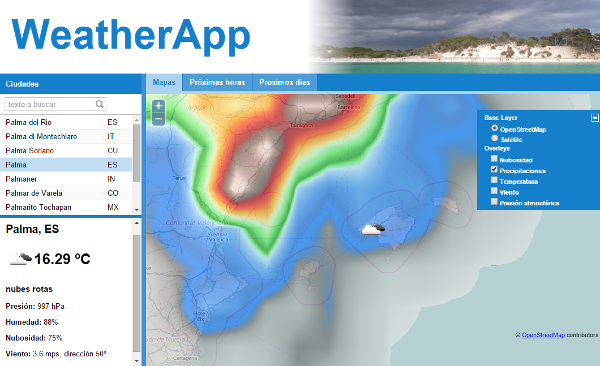

Curso JavaScript
================

Introducción a la programación con JavaScript

Código fuente del curso

## Miniproyectos

### Juego memory (JQuery)
Típico juego de cartas boca abajo donde hay que recordar la posición e ir haciendo parejas. En esta versión en lugar de imágenes se utilizan las tablas de multiplicar y se tienen como máximo 40 intentos para hacer las 10 parejas.

<a href="http://rawgit.com/xguaita/curso-javascript/master/JQuery/memory/index.html" target="_blank">Jugar</a>

### WeatherApp
Demostración del uso de las librerías Extjs 4.2.1 y el patrón MVC en una aplicación de consulta de datos meteorológicos del servicio <a href="http://openweathermap.org/" target="_blank">OpenWeatherMap</a>.

<a href="http://rawgit.com/xguaita/curso-javascript/master/weatherapp/production/index.html" target="_blank">Abrir aplicación</a>

