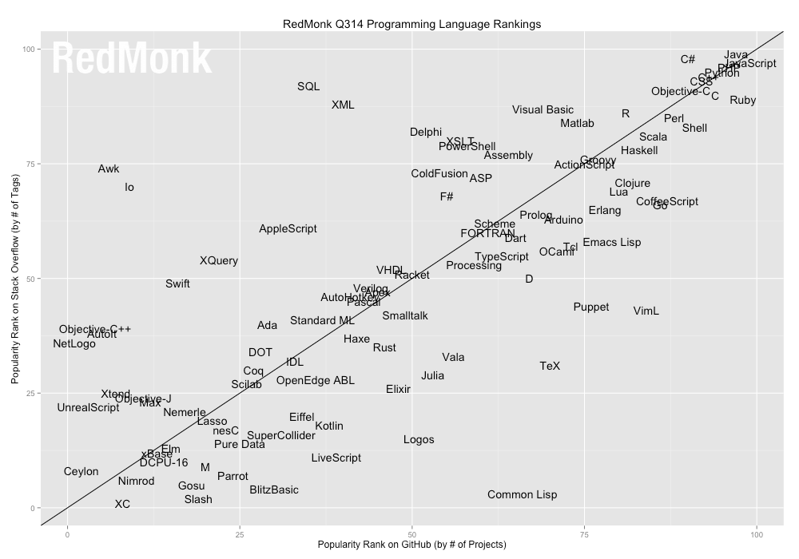

# Qué es Javascript
JavaScript es probablemente el lenguaje de programación más utilizado en la actualidad. Y el que tiene un futuro inmediato más prometedor.

Formalmente JavaScript se define como un lenguaje de **scripting** basado en **prototipos** con **tipado dinámico** y **funciones de primera clase**.  
  1. Interpretado (no compilado) en un entorno de ejecución (_run-time environment_)  
  2. Sin clases, herencia mediante clonado de objetos  
  3. Modificación del tipo de dato de las variables y estructura de objetos en tiempo de ejecución  
  4. Asignar funciones a variables o propiedades de objetos, funciones como parámetros, las funciones devuelven como valor una función

JavaScript no tiene ninguna relación con el lenguaje de programación Java, excepto similitudes en la sintaxis y construcciones. Cuando nació JavaScript Java estaba muy de moda y por cuestiones de marketing se decidió, de forma poco acertada, incluirlo en su nombre que inicialmente debía ser _LiveScript_.

## Historia
A finales de 1995 Netscape Communications Corporation en plena batalla con Microsoft por el dominio de las tecnologías web introduce en su navegador Netscape 2.0 el lenguaje JavaScript principalmente para interactuar con los _applets_ java, única forma en aquel momento de añadir interacción (programas) a una página web (contenido estático).

A mediados de 1996 Microsoft añade soporte JavaScript (JScript) a su Internet Explorer 3. Y a finales de año, Nestcape envia a ECMA Internacional la especificación de JavaScript para su consideración como estándard de la industria. En junio de 1997 ve la luz la primera versión de **ECMAScript**, actualmente nos encontramos en la 5.1.

En el 2000 Microsoft añade la tecnología **Ajax** a su navegador. Inmediatamente el resto de navegadores soportan el objeto _XMLHttpRequest_. 

En 2004 Google lanza Gmail revolucionando la forma de diseñar aplicaciones web. Aplicación de una sola página (_single page application_, SPA) que aprovecha al máximo la tecnología Ajax y consigue una velocidad y adaptabilidad inédita hasta la época.

Flash

En estos últimos años:  

  + Aplicaciones JavaScript en el servidor mediante <a href="http://nodejs.org" target="_blank">Node.js</a>, <a href="http://expressjs.com" target="_blank">Express</a>, <a href="http://mcavage.me/node-restify" target="_blank">node-restify</a>...  
  + Aplicaciones de escritorio multiplataforma: <a href="http://github.com/rogerwang/node-webkit" target="_blank">node-webkit</a>, <a href="http://www.tidesdk.org" target="_blank">TideSDK</a>...  
  + Aplicaciones móviles híbridas: <a href="http://cordova.apache.org" target="_blank">Apache Cordova</a>/<a href="http://phonegap.com" target="_blank">PhoneGap</a>, <a href="http://ionicframework.com" target="_blank">Ionic Framework</a>...  
  + Bases de datos noSQL con consolas JavaScript y estructuras de datos JSON (_JavaScript Object Notation_) para los documentos como <a href="http://www.mongodb.org" target="_blank">MongoDb</a> o <a href="http://couchdb.apache.org" target="_blank">CouchDB</a>  
  + Adopción de los estándares web en la capa de presentación de aplicaciones nativas de Windows 8, Chrome OS, Firefox OS, Gnome...

## Ventajas de javascript
  + Es uno de los lenguajes de programación más usados del momento. El primero en la programación de clientes web  
  
  
  + Aplicaciones de escritorio, programación de servidores, dispositivos móviles, bases de datos
  
  + Existencia de librerías para casi cualquier área de aplicación: mapas, gráficos, geoproceso, juegos, acceso a bases de datos no SQL, autenticación de usuarios, interacción con redes sociales...
  
  + Características de orientación a objetos basadas en el modelo de herencia mediante prototipos que lo hacen extremadamente flexible y dinámico
  
  + Gran rendimiento, cercano al de aplicaciones nativas
  
  + Sintaxis familiar para los programadores que conocen lenguajes como Java, C++, C# o PHP
  
  + Reusabilidad y portabilidad de código, entre plataformas y entre componentes (cliente y servidor)
  
  + Sustitución de la infraestructura LAMP (Linux, Apache HTTP, MySQL y PHP o Python o Perl) por MEAN (MongoDB, Express, Angular y Node.js), todas ellas con un nexo común: JavaScript
  

## Arquitectura de una aplicación web moderna

## Herramientas
Relación de herramientas de programación útiles para la programación de aplicaciones con tecnologías web, algunas de ellas las utilizaremos durante el curso:

  + Editor de texto enfocado al desarrollo web: <a href="http://brackets.io" target="_blank">Brackets</a>, <a href="http://atom.io" target="_blank">Atom</a>, <a href="http://www.jetbrains.com/webstorm" target="_blank">WebStorm</a>, <a href="http://www.sublimetext.com" target="_blank">Sublime Text</a>, <a href="http://notepad-plus-plus.org" target="_blank">Notepad++</a>...  
  + Control de versiones: <a href="http://git-scm.com" target="_blank">Git</a>, repositorios en la nube <a href="http://github.com" target="_blank">Github</a>, <a href="http://bitbucket.org" target="_blank">Bitbucked</a>...  
  + Herramientas de calidad de código (analizadores de código, _linters_) : <a href="http://www.jshint.com" target="_blank">JSHint</a>, <a href="http://www.jslint.com" target="_blank">JSLint</a>...  
  + Documentación de código y APIs: <a href="http://usejsdoc.org" target="_blank">JSDoc</a>  
  + Anotaciones TODO, FIXME...  
  + Entornos/consolas online: <a href="http://repl.it" target="_blank">repl.it</a>, <a href="http://jsfiddle.net" target="_blank">JSFiddle</a>, <a href="http://jsconsole.com" target="_blank">Javascript Console</a>...  
  + Herramientas para desarrolladores de los navegadores <a href="http://developer.chrome.com/devtools/index" target="_blank">Chrome</a>, <a href="http://developer.mozilla.org/en-US/docs/Tools" target="_blank">Firefox</a>, <a href="http://developer.apple.com/safari/tools" target="_blank">Safari</a> e incluso <a href="http://msdn.microsoft.com/es-es/library/ie/bg182326.aspx" target="_blank">Internet Explorer</a>  
  
  
  
  