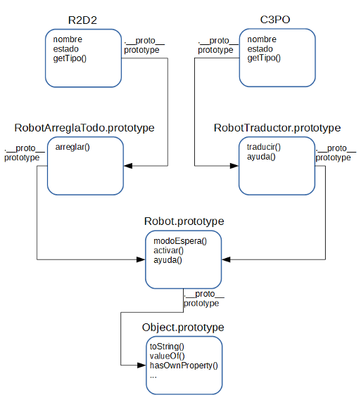

# Programación orientada a objetos
En el tema anterior hemos hablado de los objetos predefinidos, en este trataremos los objetos de usuario y cómo podemos programar en JavaScript con técnicas de orientación a objetos _clásicas_.

La programación orientada a objetos es un paradigma de programación que utiliza la abstracción para crear modelos basados en el mundo real.

Terminología básica de la programación orientada a objetos:

+ Clase: define las propiedades y el comportamiento de un tipo de objetos (sus características). Por ejemplo _coche_

+ Objeto: es la instancia (elemento concreto) de una clase. Por ejemplo _el_ coche con matrícula _7777XXX_

+ Propiedad: características de un objeto que definen su estado. Por ejemplo _color_

+ Método: características de un objeto que definen su comportamiento (qué puede hacer). Por ejemplo _acelerar_

+ Polimorfismo: los objetos comparten _interfaz_ (forma en que se accede a sus características) pero cada objeto las puede implementar de forma diferente

+ Encapsulación: cada objeto es responsable de tareas específicas. Se _encierra_ la implementación de las características del objeto en sus propiedades y métodos, y se _oculta_ al resto de la aplicación

+ Herencia: los objetos pueden heredar características de otros objetos

  > **Nota:** en JavaScript no existe el concepto de _clase_ como sí tienen los lenguajes orientados a objetos como Java, C++ o python


## Creación de objetos
Los objetos se pueden crear de tres formas diferentes:

+ Literales: es la forma más fácil de crear objetos. Entre llaves `{}` se definen propiedades (nombre `:` valor) separadas por comas `,`. El valor de la propiedad es una expresión cuyo valor puede ser un dato primitivo o un objeto (recordar que las funciones son objetos).

``` js
// Objeto de usuario
var libro= {
  titulo: 'Single Page Web Applications',
  autores: [
    'Michael S. Mikowski',
    'Josh C. Powell'
  ],
  year: 2014,
  editorial: 'Manning',
  isbn: '9781617290756',
  tags: ['SPA', 'JavaScript', 'Node.js', 'MongoDB']
}
```

+ Operador `new`: crea e inicializa un nuevo objeto a través de una función denominada _constructor_.

``` js
// Objeto de usuario
var libro= new Object();

libro.titulo= 'Single Page Web Applications';
libro.autores= [
  'Michael S. Mikowski',
  'Josh C. Powell'
];
libro.year= 2014;
libro.editorial= 'Manning';
libro.isbn= '9781617290756';
libro.tags= ['SPA', 'JavaScript', 'Node.js', 'MongoDB'];
```

+ `Object.create(<object.prototype>)`: crea un objeto a partir del _prototipo_ de otro objeto (nuevo en ECMAScript 5).

``` js
// Objeto de usuario
var libro= Object.create({});

libro.titulo= 'Single Page Web Applications';
libro.autores= [
  'Michael S. Mikowski',
  'Josh C. Powell'
];
libro.year= 2014;
libro.editorial= 'Manning';
libro.isbn= '9781617290756';
libro.tags= ['SPA', 'JavaScript', 'Node.js', 'MongoDB'];
```

  > **Nota:** `Object` es un objeto predefinido de JavaScript que se utiliza como base para crear todos los objetos (ya sean predefinos, de plataforma o de usuario)

Los objetos en JavaScript son _mutables_ y se tratan _por referencia_, al contrario que los datos primitivos que son _inmutables_ y se tratan _por valor_. Veamos que significa esto:

``` js
var dato_primitivo1= 'valor1',
    dato_primitivo2= 'valor2';
    
dato_primitivo2= dato_primitivo1;
console.log(dato_primitivo2);
dato_primitivo2= 'otro valor';
console.log(dato_primitivo1);

var objeto1= {una_propiedad: 'valor1'},
    objeto2= {una_propiedad: 'valor2'};
    
objeto2= objeto1;
console.log(objeto2.una_propiedad);
objeto2.una_propiedad= 'otro valor';
console.log(objeto1.una_propiedad);
```
<a href="http://repl.it/4bT" target="_blank">repl.it</a>

### Recuperar y asignar valores a propiedades
Se accede a las propiedades de un objeto mediante el punto `.` y los corchetes `[]`. Con la segunda opción podemos acceder a propiedades mediante expresiones.

Acceder a una propiedad que no existe devuelve `undefined`.

Para saber si un objeto tiene una propiedad se utiliza el operador `in`.

Para saber el tipo de objeto se utiliza el operador `instanceof`.

### Crear y eliminar propiedades
Podemos distinguir entre propiedades propias y heredadas. Para saber si es una propiedad propia se utiliza el método `hasOwnProperty()`.

En cualquier momento podemos crear nuevas propiedades y eliminar las propiedades propias, no las heredadas, mediante el operador `delete`.

``` js
var a= [];

console.log('Tiene propiedad length?', 'length' in a);
delete a.length;
console.log('Tiene propiedad length?', 'length' in a);

a.nueva_propiedad= 1000;
console.log('Tiene propiedad nueva_propiedad?', 'nueva_propiedad' in a);
delete a.nueva_propiedad;
console.log('Tiene propiedad nueva_propiedad?', 'nueva_propiedad' in a);
```
<a href="http://repl.it/5Dc" target="_blank">repl.it</a>

## Creación de clases

Supongamos que tenemos que trabajar con robots. Vamos a crear objetos con las características de un robot.

``` js
var R2D2= {
  nombre: 'R2D2',
  tipo: 'arreglatodo',
  estado: 0,
  modoEspera: function() {
    console.log(this.nombre + ': Iniciando modo espera...');
    this.estado= 0;
    console.log(this.nombre + ': En modo espera!');
  },
  activar: function() {
    console.log(this.nombre + ': Saliendo modo espera...');
    this.estado= 1;
    console.log(this.nombre + ': Activado!');
  },
  ayuda: function() {
    if (this.estado === 1) {
      console.log(this.nombre + ': Vengo inmediatamente!');
    } else console.log(this.nombre + ': Piiiip');
  },
  arreglar: function(item) {
    if (this.estado === 1) {
      if (item && item !== '') {
        console.log(this.nombre + ': Arreglando ' + item);
      } else console.log(this.nombre + ': Debes indicarme qué quieres que arregle');
    } else console.log(this.nombre + ': Piiiip');
  }
};

var C3PO= {
  nombre: 'C3PO',
  tipo: 'traductor',
  estado: 0,
  modoEspera: function() {
    console.log(this.nombre + ': Iniciando modo espera...');
    this.estado= 0;
    console.log(this.nombre + ': En modo espera!');
  },
  activar: function() {
    console.log(this.nombre + ': Saliendo modo espera...');
    this.estado= 1;
    console.log(this.nombre + ': Activado!');
  },
  ayuda: function() {
    if (this.estado === 1) {
      console.log(this.nombre + ': Ahora vengo. Aunque no es mi cometido intentaré ayudar');
    } else console.log(this.nombre + ': Piiiip');
  },
  traducir: function(texto) {
    if (this.estado === 1) {
      if (texto && texto !== '') {
        console.log(this.nombre + ': Traduciendo ' + texto);
      } else console.log(this.nombre + ': Debes indicarme qué quieres que traduzca');
    } else console.log(this.nombre + ': Piiiip');
  }
};
```
  > **Nota:** las funciones en javascript tienen propiedades, igual que los objetos (las funciones son objetos). Cuando se ejecuta una función se _crea_ la propiedad `this` con el valor del objeto que ha invocado la función.  
  `this` siempre hace referencia a un objeto y no tiene asignado un valor hasta que un objeto invoca la función donde se define `this`.  
  Cuando se llama a un constructor con el operador `new`, `this` hace referencia al nuevo objeto creado.
  
<a href="http://repl.it/4bi" target="_blank">repl.it</a>

  > **Pregunta:** y si tenemos 100 robots?

Tenemos que crear 100 objetos robot con todas sus características? Qué pasa si hemos de modificar un método, lo hemos de cambiar 100 veces? NO, y aquí es donde introducimos el concepto de _clase_.

  > **Nota:** recordar que en JavaScript no existe la _clase_ como un componente del lenguaje. En JavaScript se puden definir _clases_ mediante funciones (denominadas _constructores_)

Para definir _clases_ mediante _constructores_ antes debemos introducir el concepto de **prototipo**.

### Prototipos
Esta es una de las características clave de JavaScript, y como tal debemos entenderla bien. De hecho JavaScript se define como un lenguaje **orientado a prototipos** y no _orientado a objetos_ aunque, como veremos, se puede utilizar perfectamente dicho paradigma de programación.  

En un lenguaje orientado a prototipos los objetos no son creados mediante la instanciación de clases sino mediante la clonación de otros objetos.

Los dos conceptos de `prototype` en JavaScript:

  1. Todas las funciones tienen una propiedad llamada `prototype`, un objeto al cual se pueden añadir propiedades y métodos para implementar la **herencia**

  2. Todos los objetos _tienen_ un **prototipo** que hace referencia a la propiedad _prototype_ de su _padre_, aquel objeto del cual han heredado sus propiedades.  El acceso a propiedades de un objeto se realiza mediante la técnica denominada encadenamiento de prototipos (_prototype chain_)

  > **Nota1:** todos los objetos en JavaScript heredan propiedades y métodos de `Object.prototype`, que son: `constructor`, `hasOwnProperty()`, `propertyIsEnumerable()`, `isPrototypeOf()`, `toLocaleString()`, `toString()`, y `valueOf()`
  
  > **Nota2:** los objetos literales heredan propiedades y métodos de `Object.prototype`, los creados mediante `new` de la función _constructor_ correspondiente


### Función constructor
Es una función que se utiliza para inicializar nuevos objetos, se utiliza el operador `new` para invocar dicha función. Todos los objetos tienen una propiedad llamada `constructor` que apunta a esta función constructor.

Vamos a crear una _clase_ `Robot`:

``` js
// Definición de la clase Robot
function Robot(nombre, tipo) {
  this.nombre= nombre || 'sin nombre',
  this.tipo= tipo || 'arreglatodo';
  this.estado= 0;
};

Robot.prototype= {
  modoEspera: function() {
    console.log(this.nombre + ': Iniciando modo espera...');
    this.estado= 0;
    console.log(this.nombre + ': En modo espera!');
  },

  activar: function() {
    console.log(this.nombre + ': Saliendo modo espera...');
    this.estado= 1;
    console.log(this.nombre + ': Activado!');
  },

  ayuda: function() {
    if (this.estado === 1) {
      console.log(this.nombre + ': Vengo inmediatamente!');
    } else console.log(this.nombre + ': Piiiip');
  },

  arreglar: function(item) {
    if (this.estado === 1) {
      if (item && item !== '') {
        console.log(this.nombre + ': Arreglando ' + item);
      } else console.log(this.nombre + ': Debes indicarme qué quieres que arregle');
    } else console.log(this.nombre + ': Piiiip');
  },

  traducir: function(texto) {
    if (this.estado === 1) {
      if (texto && texto !== '') {
        console.log(this.nombre + ': Traduciendo ' + texto);
      } else console.log(this.nombre + ': Debes indicarme qué quieres que traduzca');
    } else console.log(this.nombre + ': Piiiip');
  }
};
// FIN definición de la clase Robot

var R2D2= new Robot('R2D2', 'arreglatodo'),
    C3PO= new Robot('C3PO', 'traductor');
```

  > **Buenas practicas:** las funciones que actúan como constructor, por convención, comienzan con mayúsculas 

<a href="http://repl.it/4bj" target="_blank">repl.it</a>

Hemos solucionado algunos problemas, ahora es mucho más fácil crear robots mediante la _clase_ `Robot`. Pero aún no todos, veamos:

``` js
C3PO.arreglar('Propulsor Halcon Milenario');
```
Ya podemos coger una nave-taxi!!!

No tenemos robots especializados, todos nuestros robots tienen las mismas características. Podríamos eliminar características segun el tipo de robot, consultar el tipo de robot en los métodos específicos y actuar en consecuencia... todo soluciones inadecuadas.

La solución correcta es crear _subclases_ de robots especializados. Para ello empleamos el concepto de **herencia**.

  
### Herencia 
Un objeto hereda las propiedades de otro objeto, su `prototype`.

Modificamos la _clase_ `Robot` y creamos dos _subclases_ `RobotArreglaTodo` y `RobotTraductor`:

``` js
// Definición de la clase Robot
function Robot(nombre) {
  this.nombre= nombre || 'sin nombre',
  this.estado= 0;
};

Robot.prototype= {
  modoEspera: function() {
    console.log(this.nombre + ': Iniciando modo espera...');
    this.estado= 0;
    console.log(this.nombre + ': En modo espera!');
  },

  activar: function() {
    console.log(this.nombre + ': Saliendo modo espera...');
    this.estado= 1;
    console.log(this.nombre + ': Activado!');
  },

  ayuda: function() {
    if (this.estado === 1) {
      console.log(this.nombre + ': Vengo inmediatamente!');
    } else console.log(this.nombre + ': Piiiip');
  }
};
// FIN definición de la clase Robot

// Definición de la subclase RobotArreglaTodo
function RobotArreglaTodo(nombre) {
  Robot.call(this, nombre); // Invocamos el constructor de Robot con this
  this.tipo= 'arreglatodo';
};

RobotArreglaTodo.prototype= Object.create(Robot.prototype);

RobotArreglaTodo.constructor= Robot;

RobotArreglaTodo.prototype.arreglar= function(item) {
  if (this.estado === 1) {
    if (item && item !== '') {
      console.log(this.nombre + ': Arreglando ' + item);
    } else console.log(this.nombre + ': Debes indicarme qué quieres que arregle');
  } else console.log(this.nombre + ': Piiiip');
};
// FIN definición de la subclase RobotArreglaTodo

// Definición de la subclase RobotTraductor
function RobotTraductor(nombre) {
  Robot.call(this, nombre); // Invocamos el constructor de Robot con this
  this.tipo= 'traductor';
};

RobotTraductor.prototype= Object.create(Robot.prototype);

RobotTraductor.constructor= Robot;

RobotTraductor.prototype.traducir= function(texto) {
  if (this.estado === 1) {
    if (texto && texto !== '') {
      console.log(this.nombre + ': Traduciendo ' + texto);
    } else console.log(this.nombre + ': Debes indicarme qué quieres que traduzca');
  } else console.log(this.nombre + ': Piiiip');
};
// FIN definición de la subclase RobotTraductor


var R2D2= new RobotArreglaTodo('R2D2'),
    C3PO= new RobotTraductor('C3PO');
```
<a href="http://repl.it/4bl" target="_blank">repl.it</a>

Seguimos teniendo algunos problemillas:

``` js
C3PO.ayuda();
```
Todos los robots implementan la tarea de ayudar a quien solicita su ayuda, pero los traductores tienen su propio concepto de la diligencia en el momento de realizar esta función.

### Polimorfismo
Comportamientos diferentes asociados a objetos diferentes pueden compartir el mismo nombre de método. Cuando se utiliza dicho método la tarea realizada dependerá del objeto en cuestión.

Si redefinimos el método `ayuda()` para los objetos `RobotTraductor` cambiaremos el comportamiento de estos objetos utilizando el mismo método.

Añadimos al código anterior:

``` js
RobotTraductor.prototype.ayuda= function() {
  if (this.estado === 1) {
    console.log(this.nombre + ': Ahora vengo. Aunque no es mi cometido intentaré ayudar');
  } else console.log(this.nombre + ': Piiiip');
};
```
<a href="http://repl.it/4bl/1" target="_blank">repl.it</a>

Ya sólo nos queda un detalle. Nada nos impide realizar la siguiente acción:

``` js
C3PO.tipo= 'arreglatodo';
```
El tipo de robot debería ser una propiedad _privada_ del robot y la única acción que deberíamos poder realizar sobre ella es recuperar su valor.

### Encapsulamiento
Cada tipo de objeto expone una interfaz (conjunto de propiedades y métodos) que especifica cómo se puede interactuar con los objetos de la clase. Si modificamos esa interfaz para, por una parte, ocultar la propiedad `tipo` y, por otra, añadir un método que devuelva su valor habremos resuelto el problema.

``` js
// Definición de la clase Robot
function Robot(nombre) {
  this.nombre= nombre || 'sin nombre',
  this.estado= 0;
};

Robot.prototype= {
  modoEspera: function() {
    console.log(this.nombre + ': Iniciando modo espera...');
    this.estado= 0;
    console.log(this.nombre + ': En modo espera!');
  },

  activar: function() {
    console.log(this.nombre + ': Saliendo modo espera...');
    this.estado= 1;
    console.log(this.nombre + ': Activado!');
  },

  ayuda: function() {
    if (this.estado === 1) {
      console.log(this.nombre + ': Vengo inmediatamente!');
    } else console.log(this.nombre + ': Piiiip');
  }
};
// FIN definición de la clase Robot

// Definición de la subclase RobotArreglaTodo
function RobotArreglaTodo(nombre) {
  var tipo= 'arreglatodo';
  Robot.call(this, nombre); // Invocamos el constructor de Robot con this
  this.getTipo= function() {
    return tipo;
  }
};

RobotArreglaTodo.prototype= Object.create(Robot.prototype);

RobotArreglaTodo.constructor= Robot;

RobotArreglaTodo.prototype.arreglar= function(item) {
  if (this.estado === 1) {
    if (item && item !== '') {
      console.log(this.nombre + ': Arreglando ' + item);
    } else console.log(this.nombre + ': Debes indicarme qué quieres que arregle');
  } else console.log(this.nombre + ': Piiiip');
};
// FIN definición de la subclase RobotArreglaTodo

// Definición de la subclase RobotTraductor
function RobotTraductor(nombre) {
  var tipo= 'traductor';
  Robot.call(this, nombre); // Invocamos el constructor de Robot con this
  this.getTipo= function() {
    return tipo;
  }
};

RobotTraductor.prototype= Object.create(Robot.prototype);

RobotTraductor.constructor= Robot;

RobotTraductor.prototype.traducir= function(texto) {
  if (this.estado === 1) {
    if (texto && texto !== '') {
      console.log(this.nombre + ': Traduciendo ' + texto);
    } else console.log(this.nombre + ': Debes indicarme qué quieres que traduzca');
  } else console.log(this.nombre + ': Piiiip');
};

RobotTraductor.prototype.ayuda= function() {
  if (this.estado === 1) {
    console.log(this.nombre + ': Ahora vengo. Aunque no es mi cometido intentaré ayudar');
  } else console.log(this.nombre + ': Piiiip');
};
// FIN definición de la subclase RobotTraductor


var R2D2= new RobotArreglaTodo('R2D2'),
    C3PO= new RobotTraductor('C3PO');
```
<a href="http://repl.it/4bm" target="_blank">repl.it</a>

  > **Ejercicio:** necesitamos robots de combate. Definir una subclase `RobotCombate` con las siguientes características: deben `atacar` y `defender` activándose automáticamente; y estos robots no ayudan.   
  > <a href="http://repl.it/5XD" target="_blank">Respuesta</a>


### _property-chain_


