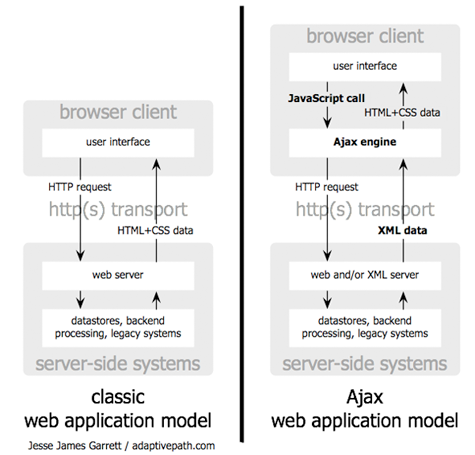

# Javascript en el navegador
Hasta ahora hemos descrito el lenguaje JavaScript própiamente dicho. Como ya sabemos,  se trata de un lenguaje interpretado que se ejecuta en un _entorno de ejecución_. En este tema estudiaremos la ejecución de JavaScript en el navegador y, por tanto, los _objetos de plataforma_ que proporciona dicho contexto.

  > **Nota:** el objetivo de este tema es conocer el contexto de ejecución de navegador y los API que proporciona a los programas escritos con JavaScript. No entraremos en detalle en la escritura de código ya que es preferible utilizar librerías que facilitan su uso, como veremos en el siguiente tema.

Si observamos los sitios web nos daremos cuenta que se pueden clasificar en dos grandes categorias:

+ Documentos web. Presentan información estática.  
  Se usa JavaScript para mejorar la experiencia de usuario (interactividad)

+ Aplicaciones web. Gestionan información dinámica.  
  Se usa JavaScript para implementar una aplicación completa que gestiona datos remotos. Se trata de una aplicación cliente/servidor que sustituye el sistema operativo como entorno de ejecución por el navegador.


## Rol de JavaScript en una página HTML


### Incrustar Javascript
+ En la cabecera o el cuerpo del documento dentro de los tags `<script></script>`  
+ Mediante un archivo externo que se carga en la cabecera del documento mediante el atributo `src` del tag `<script></script>`  
+ En el atributo del manejador de eventos de un elemento html  
+ En una url que utiliza el _protocolo_ javascript

``` html
<html>
  <head>
    <script src="micodigo.js"></script>
    <script>
      funtion comprobarNavegador() {
        if (navigator.appName == 'MSIE') alert('Cuidado!!');
      }
    </script>
  </head>
  <body onLoad="comprobarNavegador();">
    <h1>Lista</h1>
    <script>
      for (var= 0; i < lista.lenght; i++) document.write(lista[i].nombre + '<br>');
    </script>
    <a href="javascript:void open('./docs/'+doc+'.pdf');">Abrir documentación</a>
  </body>
</html>
```

## Browser Object Model (BOM)
El BOM es un API que expone el contexto de ejecución de un programa JavaScript cuando se ejecuta en un navegador. El principal inconveniente es que, al contrario que el propio lenguaje (ECMAScript) y el DOM, el BOM **no** tiene un estándar oficial. Algunas características del BOM se estandarizan en HTML5, pero no todas.

Su objetivo es que el programa pueda interactuar con el navegador.

El objeto `window` es el elemento central del contexto de ejecución en el navegador. Representa una ventana (o pestaña o frame) del navegador. Define el ámbito **global** de la aplicación.

Principales propiedades del objeto `window`:

| Propiedad | Descripción |  
| --------- | ----------- |  
| `location`| Recupera/establece la url. Devuelve una referencia al objeto <a href="https://developer.mozilla.org/en-US/docs/Web/API/Location" target="_blank"><code>Location</code></a>  |  
| `history`| Manipular el historial de la sesión de navegación. Devuelve una referencia al objeto <a href="https://developer.mozilla.org/en-US/docs/Web/API/History" target="_blank"><code>History</code></a> |  
| `navigator`| Información del navegador. Devuelve una referencia al objeto <a href="https://developer.mozilla.org/en-US/docs/Web/API/Navigator" target="_blank"><code>Navigator</code></a> |  
| `screen`| Propiedades dela pantalla. Devuelve una referencia al objeto <a href="https://developer.mozilla.org/en-US/docs/Web/API/Window.screen" target="_blank"><code>Screen</code></a> |  
| `frames`| Lista de frames, cada frame es un objeto `window` |  
| `document`| Devuelve una referencia al documento cargado en el navegador, el _document object model (DOM)_ |  

Algunas propiedades de la propia ventana:

| Propiedad | Descripción |  
| --------- | ----------- |  
| `fullScreen`| Si el navegador está en pantalla completa  |  
| `innerHeight, innerWidth`| Alto y ancho, respectivamente, de área de trabajo de la ventana  |  
| `outerHeight, outerWidth`| Alto y ancho, respectivamente, de área externa de la ventana  |  
| `menubar, toolbar, statusbar`| Devuelve sendos objetos para controlar su visibilidad  |  
| `name`| Recupera/asigna el título de la ventana  |  
| `scrollX, scrollY`| Devuelve el desplazamiento del documento  |  
| `status`| Recupera/estable el texto de la barra de estado  |  

Principales métodos:

| Método | Descripción |  
| --------- | ----------- |  
| `alert(), confirm()`| Muestra un mensaje, el segundo con confirmación  |  
| `prompt()`| Pide información al usuario  |  
| `open(), close()`| Abre/cierra una nueva ventana  |  
| `print()`| Abre el cuadro de diálogo de impresión  |  
| `scroll(), scrollBy(), scrollByLine(), scrollByPage(), scrollTo()`| Diferentes métodos para actualizar la posición de visualización del documento  |  
| `resizeBy(), ResizeTo()`| Modifica el tamaño de la ventana  |  
| `setInterval(), setTimeout()`| Ejecuta una función cada intérvalo de tiempo o después de un tiempo, respectivamente  |  

<a href="https://developer.mozilla.org/en-US/docs/Web/API/Window" target="_blank">Ampliar información...</a>

  > **Nota:** al tratarse del objeto global no es necesario escribir `window` al acceder a sus propiedades o invocar sus métodos

A través del  objeto `window` se accede al nuevo conjunto de _Web APIs_ definidas al amparo de HTML5, como por ejemplo:

+ XMLHttpRequest: peticiones asincronas de información a servidores (Ajax)  
+ Geolocation API: permite al navegador acceder a la geolocalización del dispositivo  
+ Web Sockets API: conexión a servidores mediante _streams_ bidireccionales  
+ IndexDB API: almacenar y recuperar objetos en bases de datos simples  
+ Filesystem API: lectura y escritura de ficheros  


## Document Object Model (DOM)
El DOM es el API de los documentos HTML, XML y SVG. Proporciona una representación estructurada (en  forma de árbol) del documento HTML que genera el navegador cuando carga una página, y define la forma en que los programas pueden acceder a esta estructura para interactuar con ella: añadir, modificar o eliminar componentes.

El DOM se ha diseñado para ser independiente del lenguaje de programación que manipula sus componentes; nosotros accederemos mediante JavaScript pero existen implementaciones en diferentes lenguajes, como Python, Java, C++...

Ejemplo:

```html
<html lang="es">
  <head>
    <meta http-equiv="Content-Type" content="text/html; charset=UTF-8">
  </head>
  <body>
    <h1>Título</h1>
    <p>Primer párrafo del documento <span class="clase1">de prueba</span></p>
    <ul>
      <li>Uno</li>
      <li>Dos</li>
      <li>Tres</li>
    </ul>
    <table class="tg">
      <tr>
        <th>Cabecera 1</th>
        <th>Cabecera 2</th>
        <th>Cabecera 3</th>
        <th>Cabecera 4</th>
      </tr>
      <tr>
        <td>1-1</td>
        <td>1-2</td>
        <td id="miCelda">1-3</td>
        <td>1-4</td>
      </tr>
      <tr>
        <td>2-1</td>
        <td class="clase1">2-2</td>
        <td>2-3</td>
        <td>2-4</td>
      </tr>
    </table>
  </body>
</html>
```


Todos los componentes del documento son _nodos_ en el árbol, cada tag html es un nodo de tipo _elemento_ y cada fragmento de texto es un nodo de tipo _texto_. Los _nodos_ y _elementos_ son objetos con propiedades y métodos que nos permiten:

+ Navegar por el árbol de nodos  
+ Buscar elementos  
+ Modificar el documento

Vamos a _ver_ el DOM utilizando las herramientas para desarrolladores que implementan los navegadores (generalmente la pestaña _elements_). <a href="http://rawgit.com/xguaita/curso-javascript/master/modulo4/ejemplo.html" target="_blank">Abrir ejemplo en el navegador...</a>

### Navegar (moverse) por el DOM
La raiz del documento es `document.documentElement` y de cuerpo del documento `document.body`. Este último puede devolver `null` si no hay cuerpo de documento.

  > **Nota:** como regla general no se puede referenciar un elemento que aún no se ha renderizado

En la consola del navegador escribir:

``` js
document.documentElement
document.body
```

Principales propiedades y métodos:

| Propiedad | Descripción |  
| --------- | ----------- |  
| `children, chilNodes`| Devuelve un array con todos los elementos hijos o sus nodos, respectivamente  |  
| `firstChild, lastChild`| Devuelve el primer y último nodo hijo  |  
| `parentNode`| Devuelve el nodo padre  |  
| `previousSibling, nextSibling`| Devuelve el hermano anterior y el siguiente, respectivamente  |  

En la consola:

``` js
document.body.children
document.body.chilNodes
document.body.firstChild
document.body.firstChild.nextSibling
document.body.lastChild.previousSibling
```

### Recuperar elementos

| Método | Descripción | Interfaz |  
| --------- | ----------- | -------- |  
| `getElementById()`| Recupera un elemento por su id | documento |  
| `getElementsByTagName()`| Devuelve un array con los elementos de un determinado _tag_ | documento y nodo |  
| `getElementsByName()`| Para elementos con el atributo `name` | documento |  
| `getElementsByClassName()`| Devuelve array con elementos de una clase (estilo CSS) | documento y nodo |  
| `querySelector(), querySelectorAll()`| Busca por consulta CSS3, devuelve el primer elemento encontrado o todos ellos | documento y nodo |  

En la consola:

``` js
document.getElementById('miCelda')
document.getElementsByTagName('th')
document.getElementsByClassName('clase1')
document.querySelector('ul > li')
```

### Propiedades de los nodos

| Propiedad | Descripción |  
| --------- | ----------- |  
| `nodeType`| Tipo de nodo, devuelve 1 si tipo elemento o 3 si texto |  
| `nodeName/tagName`| Devuelven el nombre del nodo |  
| `innerHTML, nodeValue`| Devuelven/establecen el valor de un elemento o nodo de texto, respectivamente |  

En la consola:

``` js
document.body.firstChild.nodeType
document.body.firstChild.nextSibling.nodeType
document.getElementById('miCelda').nodeName
document.getElementById('miCelda').tagName
document.getElementById('miCelda').innerHTML
```

  > **Nota:** como cualquier objeto JavaScript podemos añadir dinámicamente propiedades a los objeos del DOM, que serán visibles únicamente en el programa 

### Atributos de elementos

| Métodos | Descripción |  
| --------- | ----------- |  
| `hasAttribute()`| Comprueba si el elemento tiene un determinado atributo |  
| `getAttribute()/setAttribute()`| Devuelven/establece el valor de un atributo |  
| `removeAttribute()`| Elimina un atributo |  

En la consola:

``` js
document.getElementById('miCelda').hasAttribute('style')
document.getElementById('miCelda').setAttribute('style', 'text-align: center')
document.getElementById('miCelda').removeAttribute('style')
```

### Modificar el documento

| Método | Descripción | Interfaz |  
| --------- | ----------- | -------- |  
| `createElement(), createTextNode()`| Crea un nuevo elemento o nodo de texto, respectivamente | documento |  
| `cloneNode()`| Copia un nodo | nodo |  
| `appendChild(), removeChild()`| Añade/elimina un elemento | nodo |  
| `insertBefore()`| Devuelve array con elementos de una clase (estilo CSS) | nodo |  
| `replaceChild()`| Busca por consulta CSS3, devuelve el primer elemento encontrado o todos ellos | nodo |  

En la consola:

``` js
miImg= document.createElement('img')
miImg.setAttribute('src', 'https://www.google.es/images/srpr/logo11w.png')
document.body.appendChild(miImg)
document.getElementById('miCelda').innerHTML= 'Nuevo contenido de miCelda'
```

El método `document.write` escribe html en un documento **abierto** (antes de que esté completamente cargado en el navegador). Si el documento ya está cerrado (cargado completamente) y se utiliza el método se crea un nuevo documento.

``` js
document.write('<h1>Nuevo documento</h1>')
for (i= 1; i <= 10; i++) document.write(i + '. Línea de texto<br>')
```

## Eventos
Las aplicaciones web usan un modelo de programación _basado en eventos_. Los programas esperan, sin realizar ninguna tarea, hasta que se produce un _evento_: se carga la página, se pulsa un botón, se selecciona un elemento, se mueve el ratón sobre un elemento...

Un evento es una _señal_ que envia un objeto de que algo ha pasado.

Podemos dividir los eventos en dos grandes grupos:

+ Eventos de plataforma:  
  + Eventos de los objetos del DOM: `click`, `select`, `load`, `mousedown`, `keypress`, `focus`...  
  + Eventos de HTML5: `loadstart`, `progress` (XMLHttpRequest), `success` (GeoLocation), `play, `volumechange` (video, audio)...   
  + Pantallas táctiles y dispositivos móviles: `gesturestart`, `touchstart`, `touchend`...
+ Eventos de objetos de usurio. Por ejemplo, librería de _web mapping_: `zoomend`, `movestart`, `layeradd`, `baselayerchange`...

### Responder a eventos
Las funciones que responden a los eventos se denominan _events handlers_ o _events listener_ (manejadores de eventos). Generalmente el nombre de la función es `on`+`nombre de evento` (`onChange`, `onLayerAdd`...).

Hay tres formas de asignar manejadores de eventos a elementos:

+ En un atributo del propio tag html:  
``` html

```
+ Propiedad del elemento del DOM:  
``` js
document.getElementById('img1').onclick = function() {
  alert('Mensaje')
};
```
+ El método `addEventListener(evento, funcion, false)`:  
``` js
document.getElementById('img1').addEventListener('click', function() {
  alert('Mensaje')
}, false);
```
  `removeEventListener()` elimina un manejador asignado a un elemento con `addEventListener()`.

La función manejador siempre recibe un parámetro el objeto `event`. Este objeto siempre tiene una propiedad `type` que nos informa del tipo de evento. Dependiendo del tipo de evento puede tener propiedades adicionales. Por ejemplo el evento `click` añade las propiedades `target` (qué elemento ha recibido el click), `clientX/clientY` (coordenadas del ratón en el momento del click)...

### Propagación y captura de eventos
Los eventos se propagan (_bubbling_) de las _hojas_ del árbol del DOM hacia la _raiz_. Mientras el evento se propaga hacia arriba todos los manejadores responderán al evento.

Para interrumpir la propagación, el manejador puede invocar el método `stopPropagation()`.

La captura de un evento implica invertir el orden de propagación, de la raiz hacia las hojas. Se captura un evento con el método `addEventListener()` definiendo el tercer parámetro a `true`.

En la consola:

``` js
document.getElementById('miCelda').addEventListener('click', function() {
  alert('Manejador de evento click en miCelda')
}, false);
```

## Ajax y JSON
Ajax (_Asynchronous JavaScript and XML_) es una técnica (NO una tecnología) que hace referencia al uso del objeto `XMLHttpRequest` para comunicarse con servicios web del servidor. Es una colección de tecnologías (HTML, CSS, JavaScript, DOM, XMLHttpRequest, JSON/XML) para crear aplicaciones web **asíncronas**.

El término lo acuñó en el 2005 Jesse James Garrett en un artículo titulado <a href="http://www.adaptivepath.com/ideas/ajax-new-approach-web-applications/" target="_blank">_Ajax: A New Approach to Web Applications_</a> y los primeros en utilizar estas técnicas en aplicaciones reales fueron Google con su GMail (2004) y, sobre todo, Maps (2005). 

Modelo de aplicación _clásico_ frente al uso de técnicas ajax:



  > **Nota:** este _motor ajax_ es el objeto `XMLHttpRequest`, 

Flujo de datos de un modelo síncrono frente a uno asíncrono:


### El objeto ```XMLHttpRequest```
Es un objeto de plataforma (implementado por el navegador) que permite realizar peticiones a servidores en segundo plano (de forma asíncrona, aunque se puede realizar también de forma síncrona) sin necesidad de recargar la página.

El procedimiento básico de uso es el siguiente:

+ Crear un objeto ```XMLHttpRequest```  
+ Definir función para tratar la respuesta   
+ Establecer parámetros de la petición y enviarla  

En breve veremos un ejemplo.

Sus principales propiedades y métodos son:

| Propiedades | Descripción |  
| --------- | ----------- |  
| `readyState`| Estado de la petición (4 completado) |  
| `status`| Código HTTP devuelto por el servidor (200 ok) |  
| `responseText`| Respuesta en formato texto |  
| `responseXML`| Respuesta en formato XML (objeto DOM) |  

| Métodos | Descripción |  
| --------- | ----------- |  
| `onreadystatechange`| Referencia a función que se encarga de manejar el evento de cambio de estado de la petición |  
| `open(GET/POST, url)`| Establecer parámetros de la petición |  
| `send(data)`| Realiza la petición |  
| `abort()`| Aborta la petición en curso |  

<a href="https://developer.mozilla.org/en-US/docs/Web/API/XMLHttpRequest" target="_blank">Ampliar información...</a>

#### same-origin policy
Define una politica de seguridad de los navegadores que previene que el documento o código cargado de un sitio web (origen) pueda interactuar con un recurso de un origen distinto. Por origen se entiende la misma combinación de protocolo, host y puerto.

Qué recursos es lícito cargar desde otros orígenes?

+ JavaScript con `<script src="..."></script>`  
+ CSS con `<link rel="stylesheet" href="...">`  
+ Imágenes con ``  
+ Multimedia con `<video>` y `<audio>`  
+ Plug-ins con `<object>`, `<embed>` y `<applet>`  
+ Fuentes con `@font-face`  
+ Cualquier recurso con `<frame>` y `<iframe>`  

El objeto `XMLHttpRequest` se ve afectado por esta política de seguridad, por lo tanto las aplicaciones Ajax se ven afectadas.

Procedimientos más comunes para realizar peticiones a otros orígenes (y saltarse la política de seguridad):

+ Proxy: en el mismo origen ponemos un recurso (programa, servicio) que realizará las peticiones al exterior y devolverá la respuesta  
+ JSONP (_JSON with padding_): se aprovecha de que se pueden cargar `<script src="..."></script>` de distintos orígenes para pedir al servidor la respesta JSON encerrada en una función de _callback_  
+ CORS (_Cross-Origin Resource Sharing_): técnica estandarizada que extiende el protocolo HTTP con una nueva cabecera de petición `Origin` (que indica el origen de la petición) y otra nueva de respuesta `Access-Control-Allow-Origin` (que indica que orígenes son válidos), según la cual el navegador actúa en consecuencia  


### JSON (_JavaScript Object Notation_)
<a href="http://json.org/" target="_blank">JSON</a> es un <a href="http://www.ecma-international.org/publications/files/ECMA-ST/ECMA-404.pdf" target="_blank">estándard</a> para el intercambio de datos entre aplicaciones web y servidores alternativo a XML, sencillo de leer y escribir para las personas, y sencillo de interpretar y generar para los ordenadores. Es el formato de intercambio más utilizado en las técnicas Ajax.

Originalmente deriva de JavaScript pero es un formato independiente del lenguaje de programación. Se utiliza también para _serializar_ (guardar el estado) de objetos. Bases de datos como como <a href="http://www.mongodb.org" target="_blank">MongoDb</a> o <a href="http://couchdb.apache.org" target="_blank">CouchDB</a> utilizan BJSON (JSON binario) para almacenar documentos.

A partir de JSON se derivan nuevos estándares como <a href="http://geojson.org/" target="_blank">GeoJSON</a> o <a href="https://github.com/topojson/topojson-specification/blob/master/README.md" target="_blank">TopoJSON</a>, especificaciones para codificar colecciones de elementos geográficos, la segunda extensión de la primera a la que añade topología geoespacial.

Soporta únicamente los siguientes tipos de datos:

+ Number  
+ String: encerrados entre comillas dobles `"`  
+ Array: lista ordenada de 0 o más valores separados por comas y encerrados entre corchetes `[]`  
+ Object: lista NO ordenada de pares nombre/valor separados por comas y encerrados entre llaves `{}`. El nombre debe encerrarse entre comillas dobles `"`, separarse del valor por dos puntos `:` y éste puede ser cualquier tipo soportado  
+ null

``` json
{
  "message": "accurate",
  "cod": "200",
  "count": 1,
  "list": [{
    "id": 2512989,
    "name": "Palma",
    "coord": {
      "lon": 2.65024,
      "lat": 39.569389
    },
    "main": {
      "temp": 15.39,
      "pressure": 1016,
      "humidity": 93,
      "temp_min": 15,
      "temp_max": 15.7
    },
    "dt": 1416944545,
    "wind": {
      "speed": 2.77,
      "deg": 179
    },
    "sys": {
      "country": "ES"
    },
    "clouds": {
      "all": 20
    },
    "weather": [{
      "id": 801,
      "main": "Clouds",
      "description": "algo de nubes",
      "icon": "02n"
    }]
  }]
}
```

JavaScript implementa el objeto predefinido `JSON` para convertir objetos a JSON y viceversa:

| Métodos | Descripción |  
| --------- | ----------- |  
| `parse()`| Transforma texto JSON en sus correspondientes valores |  
| `stringify()`| Transforma valores en texto JSON |  

### Ejemplo Ajax
<a href="http://openweathermap.org/" target="_blank">OpenWeatherMap</a> es un servicio que proporciona datos meteorológicos abiertos de más de 200.000 ciudades del mundo desde su web y a través de un <a href="http://openweathermap.org/api" target="_blank">API</a>.

Utilizaremos el API de OpenWeatherMap para este ejemplo y el proyecto de aplicación web del curso.

Contenido de la página HTML:

``` html
<body>
  <p>
    Ciudad: <input type="text" id="ciudad"> <input type="button" value="Buscar" onclick="getWeather()">
  </p>
  <div id="div_resp"></div>
</body>
```
La función `getWeather` realiza la petición `XMLHttpRequest`:

``` js
function getWeather() {
  var query= document.getElementById('ciudad').value;

  if (query === '') {
    alert('Texto en blanco');
    return;
  }

  var req = new XMLHttpRequest();
  req.open('get', 'http://api.openweathermap.org/data/2.5/find?type=like&lang=es&units=metric&q=' + query);

  // cada vez que cambia el estado de la petición...
  req.onreadystatechange = function () {
    if (req.readyState === 4) { // readyState 4 cuando ha finalizado la petición
      if (req.status === 200) { // 200 ok
        evalResp(req.responseText); // evalúa la respuesta
      } else {
        alert('Error: ' + req.status); // Ha ocurrido un error
      }
    }
  }
  req.send(); // envía petición
}
```
La función `evalResp` trata la respuesta y actualiza parte del contenido de la página:

``` js
function evalResp(resp) {
  var result = JSON.parse(resp),
      div_resp= document.getElementById('div_resp'),
      newHtml= '';

  if (result.cod !== '200' || result.count === 0) {
    div_resp.innerHTML= 'Ningún resultado';
    return;
  } else {
    for (var i= 0; i < result.list.length; i++) newHtml+= '<b>'+result.list[i].name+' ('+result.list[i].sys.country+'):</b> '+result.list[i].main.temp+' ºC<br>'
  }
  div_resp.innerHTML= newHtml;
}
```

<a href="http://rawgit.com/xguaita/curso-javascript/master/modulo4/ajax.html" target="_blank">Abrir ejemplo en el navegador...</a>
