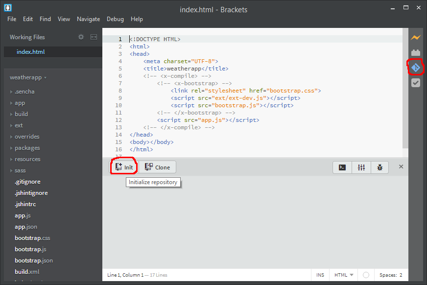

# Ext JS

<a href="http://www.sencha.com/products/extjs/" target="_blank">Ext JS</a> es una librería de componentes y _framework_ para construir aplicaciones web empresariales de la organización _Sencha_. Como librería define componentes de interfaz de usuario (cuadros de texto, listas, pestañas, árboles, formularios, ventanas...), de acceso a datos remotos mediante técnicas Ajax, creación de animaciones y gráficos... Como _framework_ de implementa el modelo MVC de diseño de aplicaciones (en la versión 5 también el modelo MVVM).

Existe un producto similar adaptado a dispositivos  móviles, <a href="http://www.sencha.com/products/touch/" target="_blank">Sencha Touch</a>.

Dispone de una completísima <a href="http://docs.sencha.com/extjs/4.2.1/" target="_blank">documentación</a> con tutoriales, videos de uso, ejemplos...

### MVC (_Model-View-Controller_)
Es un patrón de diseño de desarrollo de aplicaciones que separa de forma clara la representación interna de los **datos** (Modelo), de su **presentación** (Vista) al usuario y de su **manipulación** (Controlador).


La arquitectura MVC implementada por Extjs, de forma muy general, se define como: 

+ Model: colección de campos y sus datos, usados en combinación con los _Store_ (almacenes de datos) para presentar la información en las vistas  
+ View: son los componentes de interfaz de usuario (grids, trees, panels, tabpanels...)  
+ Controller: es donde reside la lógica de la aplicación (código que hace que la aplicación trabaje)  

## Proyecto

Descargar e instalar <a href="http://git-scm.com/" target="_blank">git</a>, un gestor de versiones: <a href="https://github.com/msysgit/msysgit/releases/download/Git-1.9.4-preview20140929/Git-1.9.4-preview20140929.exe" target="_blank">Git-1.9.4-preview20140929.exe</a>

Descargar e instalar <a href="http://brackets.io/" target="_blank">Brackets</a>, un editor de texto pensado para el desarrollo de aplicaciones web: <a href="https://github.com/adobe/brackets/releases/download/release-1.0/Brackets.Release.1.0.msi" target="_blank">Brackets.Release.1.0.msi</a> :

En Brackets, menú _File_ -> _Extension manager..._ e instalar las siguientes extensiones:
+ Beautify  
+ Brackets Git  
+ JSHint  
+ Todo


Descargar las librerías Extjs 4.2.1 (licencia de código abierto GPL) y descomprimir: <a href="http://cdn.sencha.com/ext/gpl/ext-4.2.1-gpl.zip" target="_blank">ext-4.2.1-gpl.zip</a>

Descargar e instalar <a href="http://www.sencha.com/products/sencha-cmd/" target="_blank">**Sencha Cmd**</a> versión 4, una herramienta de productividad para construir aplicaciones web con Ext JS siguiendo la arquitectura MVC: <a href="http://cdn.sencha.com/cmd/4.0.4.84/SenchaCmd-4.0.4.84-windows.exe.zip" target="_blank">SenchaCmd-4.0.4.84-windows.exe.zip</a>

Abrir una ventana de _Símbolo de Sistema_ (ventana de línea de comandos) y crear una aplicación con _Sencha Cmd_:

`sencha -sdk <path al directorio librerías extjs> generate app weatherapp c:\weatherapp`

En c:\weatherapp se ha creado la estructura de una aplicación MVC siguiendo el modelo de ExtJS. 

Copiar estos 3 ficheros a c:\weatherapp (configuración de jshint y git): <a href="https://raw.githubusercontent.com/xguaita/curso-javascript/master/weatherapp/.jshintignore" target="_blank">.jshintignore</a>, <a href="https://raw.githubusercontent.com/xguaita/curso-javascript/master/weatherapp/.jshintrc" target="_blank">.jshintrc</a> y <a href="https://raw.githubusercontent.com/xguaita/curso-javascript/master/weatherapp/.gitignore" target="_blank">.gitignore</a>

Con Brackets, _File_ -> _Open Folder..._ y abrir c:\weatherapp. Lanzar el servidor web integrado y ver el resultado de la aplicación creada (sólo funciona con Google Chrome):


Inicializar repositorio git:



A partir de ahora git hará el seguimiento de cambios del código del proyecto.

Modificar el tema por defecto de la aplicación por el tema _neptune_ de apariencia más moderna. Seleccionar .sencha\app\sencha.cfg y modificar la linea 32, guardar los cambios:

`app.theme=ext-theme-neptune`

En la ventana de _Símbolo de Sistema_, movernos a c:\weatherapp y actualizar las aplicación con los cambios de tema:

`sencha app build`

Refrescar el navegador y ver los cambios.

En Brackets, boton de Git -> seleccionar ficheros modificados -> botón Commit -> Mensaje de commit: Tema neptune -> Ok


Cada vez que hacemos _commit_ guardamos una versión del programa y podemos ver los cambios hechos desde el _commit_.

En la ventana de _Símbolo de Sistema_, genera 3 vistas:

```
sencha generate view --name Ciudades
sencha generate view --name TabHoras
sencha generate view --name TabDias
```

Se crean 3 ficheros en app\view:


En cada uno de ellos modificar de la siguiente forma:

``` js
Ext.define("weatherapp.view.Ciudades", {
    extend: 'Ext.Component',
	alias: 'widget.weatherAppCiudades',
    html: 'Panel de ciudades!!'
});
```

``` js
Ext.define("weatherapp.view.TabHoras", {
    extend: 'Ext.Component',
	alias: 'widget.weatherAppHoras',
    html: 'Pestaña de previsión próximas horas!!'
});
```

``` js
Ext.define("weatherapp.view.TabDias", {
    extend: 'Ext.Component',
	alias: 'widget.weatherAppDias',
    html: 'Pestaña de previsión próximos días!!'
});
```

Actualizar referencias de la aplicación (app\Application.js), debe quedar:

``` js
Ext.define('weatherapp.Application', {
    name: 'weatherapp',

    extend: 'Ext.app.Application',

    views: [
        'Ciudades',
		'TabHoras',
		'TabDias'
    ],

    controllers: [
        // TODO: add controllers here
    ],

    stores: [
        // TODO: add stores here
    ]
});
```

Actualizar el viewport (app\view\Main.js):

``` js
Ext.define('weatherapp.view.Main', {
    extend: 'Ext.container.Container',
    requires:[
        'Ext.tab.Panel',
        'Ext.layout.container.Border',
		'weatherapp.view.Ciudades',
		'weatherapp.view.TabHoras',
		'weatherapp.view.TabDias'
    ],

    xtype: 'app-main',

    layout: {
        type: 'border'
    },

    items: [{
        region: 'north',
        xtype: 'container',
		layout: 'fit',
        height: 130,
		html: 'WeatherApp'
    },{
        region: 'west',
        xtype: 'weatherAppCiudades',
        title: 'Ciudades',
		collapsible: false,
		split: true,
        width: 250,
		maxWidth: 250,
		minWidth: 150
    },{
        region: 'center',
        xtype: 'tabpanel',
        items:[{
            title: 'Próximas horas',
			xtype: 'weatherAppHoras'
        }, {
            title: 'Proximos días',
			xtype: 'weatherAppDias'
		}]
    }]
});
```

Nuevo _commit_, seleccionar todos los ficheros cambiados. Texto de _commit_ "Vistas".

Actualizar navegador:


Crear modelo Ciudad, en la ventana de _Símbolo de Sistema_:

`sencha generate model --name Ciudad --fields id:int,name:string,coord:auto,main:auto,dt:int,wind:auto,sys:auto,clouds:auto,weather:auto`

Se crea fichero Ciudad.js en app\model. Añadimos el identificador de elemento en Ciudad.js:

``` js
Ext.define('weatherapp.model.Ciudad', {
    extend: 'Ext.data.Model',
    
    fields: [
        { name: 'id', type: 'int' },
        { name: 'name', type: 'string' },
        { name: 'coord', type: 'auto' },
        { name: 'main', type: 'auto' },
        { name: 'dt', type: 'int' },
        { name: 'wind', type: 'auto' },
        { name: 'sys', type: 'auto' },
        { name: 'clouds', type: 'auto' },
        { name: 'weather', type: 'auto' }

    ],
    idProperty: 'id'
});
```

Creamos un almacen para las ciudades. Sencha Cmd v4 no crea _stores_. _File_ -> _New_ y pegar el siguiente código:

``` js
Ext.define('weatherapp.store.Ciudades', {
    extend: 'Ext.data.Store',
    requires: [
		'weatherapp.model.Ciudad'
	],
    model: 'weatherapp.model.Ciudad',

    proxy: {
        type: 'jsonp',
        url: 'http://api.openweathermap.org/data/2.5/find',
		limitParam: undefined,
		startParam: undefined,
		pageParam: undefined,
		extraParams: {
			type: 'like',
			lang: 'es',
			units: 'metric',
			q: 'palma'
		},
        reader: {
            type: 'json',
            root: 'list'
        }
    },

	autoLoad: true
});
```

Guardar en app\store como Ciudades.js.

Ponemos la url de servicio de Openweathermaps con parámetros fijos. Ya lo cambiaremos más adelante.

Actualizar referencias de la aplicación (app\Application.js):

``` js
Ext.define('weatherapp.Application', {
    name: 'weatherapp',

    extend: 'Ext.app.Application',

    views: [
        'Ciudades',
		'TabHoras',
		'TabDias'
    ],

    controllers: [
        // TODO: add controllers here
    ],

    stores: [
        'Ciudades'
    ]
});
```

Commit "Store ciudades"

Modificamos la vista Ciudades (app\view\Ciudades.js):

+ Convertimos el _component_ en un _panel_  
+ Dividimos el panel en 2  
+ En la parte de arriba creamos un _grid_ para visualizar las ciudades que tenemos en el _store_

``` js
Ext.define("weatherapp.view.Ciudades", {
    extend: 'Ext.panel.Panel',
    requires: [
        'Ext.form.field.Trigger',
        'Ext.grid.Panel',
        'Ext.grid.column.Template'
    ],
	alias: 'widget.weatherAppCiudades',
	layout: {
		type: 'vbox',
		align: 'stretch'
	},
    items: [
		{
			xtype: 'gridpanel',
			itemId: 'lstCiudades',
			flex: 2,
			store: 'Ciudades',
			forceFit: true,
			hideHeaders: true,
			autoScroll: true,
			scroll: 'vertical',
			columns: [
				{text: 'Ciudad',  dataIndex:'name'},
				{text: 'País',  xtype: 'templatecolumn', tpl: '{sys.country}', width: 30}
			]
		},
		{
			xtype: 'component',
			itemId: 'infoCiudad',
			flex: 3
		}
	]
});
```

Commit "Panel y lista ciudades"

En la ventana de _Símbolo de Sistema_, actualizamos cambios en la aplicación:

`sencha app build`

Refrescar el navegador y ver que la lista de ciudades se recupera del servicio de openweathermap.

Queremos hacer cosas al seleccionar una ciudad. Vamos a empezar a trabajar con eventos y a programar tareas. Para ello utilizamos los controladores (app\Controller\Main.js) debe quedar como:

``` js
Ext.define('weatherapp.controller.Main', {
    extend: 'Ext.app.Controller',

	views: [
		'Ciudades'
	],

    refs: [{
        ref: 'InfoCiudad',
        selector: '#infoCiudad'
    }],

    stores: ['Ciudades'],

	init: function() {
		this.control({
			'#lstCiudades': {
				select: this.onCiudadSelect
			}
		});
	},
	
	// Ciudad seleccionada
	onCiudadSelect: function(selModel, rec) {
		if (rec !== null) {
			this.getInfoCiudad().update(rec.data);
		}

	}

});
```

Actualizar referencias de la aplicación (app\Application.js):

``` js
Ext.define('weatherapp.Application', {
    name: 'weatherapp',

    extend: 'Ext.app.Application',

    views: [
        'Ciudades',
		'TabHoras',
		'TabDias'
    ],

    controllers: [
        'Main'
    ],

    stores: [
        'Ciudades'
    ]
});
```

Visualizamos la informción de la ciudad seleccionada, en app\view\Ciudades.js modificamos el componente de información (infoCiudad):

``` js
Ext.define("weatherapp.view.Ciudades", {
    extend: 'Ext.panel.Panel',
    requires: [
        'Ext.form.field.Trigger',
        'Ext.grid.Panel',
        'Ext.grid.column.Template'
    ],
	alias: 'widget.weatherAppCiudades',
	layout: {
		type: 'vbox',
		align: 'stretch'
	},
    items: [
		{
			xtype: 'gridpanel',
			itemId: 'lstCiudades',
			flex: 2,
			store: 'Ciudades',
			forceFit: true,
			hideHeaders: true,
			autoScroll: true,
			scroll: 'vertical',
			columns: [
				{text: 'Ciudad',  dataIndex:'name'},
				{text: 'País',  xtype: 'templatecolumn', tpl: '{sys.country}', width: 30}
			]
		},
		{
          xtype: 'component',
          itemId: 'infoCiudad',
          flex: 3,
          autoScroll: true,
          scroll: 'vertical',
          padding: 10,
          style: {
              'border-top-width': '5px',
              'border-top-style': 'solid',
              'border-top-color': '#157fcc'
          },
          tpl: [
              "<h2>{name}, {sys.country}</h2>",
              "<h1>{main.temp} ºC</h1>",
              "<h3>{[values.weather[0].description]}</h3>",
              "<p><b>Presión:</b> {main.pressure} hPa</p>",
              "<p><b>Humedad:</b> {main.humidity}%</p>",
              "<p><b>Nubosidad:</b> {clouds.all}%</p>",
              "<p><b>Viento:</b> {wind.speed} mps, dirección {wind.deg}º</p>"
          ]
		}
	]
});
```

Commit "Actualizar infoCiudad"

Actualizamos el navegador y seleccionando ciudades se muestra su información meteorológica:


Ahora vamos a crear un gráfico del tiempo en las próximas horas.

En la ventana de _Símbolo de Sistema_, generamos el modelo de datos meteorológicos por horas:

`sencha generate model --name Horas --fields dt:int,temp:auto,weather:auto,clouds:auto,wind:auto,rain:auto,dt_txt:string`

Modificamos el modelo creado app\model\Horas.js:

``` js
Ext.define('weatherapp.model.Horas', {
    extend: 'Ext.data.Model',
    
    fields: [
        { name: 'dt', type: 'int' },
        { name: 'temp', mapping: 'main.temp' },
        { name: 'weather', mapping: 'weather[0].description' },
        { name: 'clouds', mapping: 'clouds.all' },
        { name: 'wind', mapping: 'wind.speed' },
        { name: 'rain', convert: function(v){
            return v['3h'];
        }},
        { name: 'dt_txt', type: 'string' }

    ],
    idProperty: 'dt'
});
```

Creamos un almacen para las horas. _File_ -> _New_ y pegar el siguiente código:

``` js
Ext.define('weatherapp.store.Horas', {
    extend: 'Ext.data.Store',
    requires: [
		'weatherapp.model.Horas'
	],
    model: 'weatherapp.model.Horas',

	proxy: {
        type: 'jsonp',
        url: 'http://api.openweathermap.org/data/2.5/forecast',
		limitParam: undefined,
		startParam: undefined,
		pageParam: undefined,
		extraParams: {
			lang: 'es',
			units: 'metric'
		},
        reader: {
            type: 'json',
            root: 'list'
        }
    },

    filters: [
        function(item) {
            if (item.index < 16) return true;
            return false;
        }
    ],
  
	autoLoad: false
});
```
Guardar en app\store como Horas.js.

Actualizar referencias de la aplicación (app\Application.js):

``` js
Ext.define('weatherapp.Application', {
    name: 'weatherapp',

    extend: 'Ext.app.Application',

    views: [
        'Ciudades',
		'TabHoras',
		'TabDias'
    ],

    controllers: [
        'Main'
    ],

    stores: [
        'Ciudades',
		'Horas'
    ]
});
```

Y en el controlador (app\controller\Main.js), creamos la referencia al store y lo cargamos con los datos de la ciudad: seleccionada:

``` js
Ext.define('weatherapp.controller.Main', {
    extend: 'Ext.app.Controller',

	views: [
		'Ciudades'
	],

    refs: [{
        ref: 'InfoCiudad',
        selector: '#infoCiudad'
    }],

    stores: [
        'Ciudades',
        'Horas'
    ],

	init: function() {
		this.control({
			'#lstCiudades': {
				select: this.onCiudadSelect
			}
		});
	},

	// Ciudad seleccionada
	onCiudadSelect: function(selModel, rec) {
		if (rec !== null) {
			this.getInfoCiudad().update(rec.data);
		}
      
        this.getHorasStore().load({
            params: {
                id: rec.data.id
            }
        });

	}

});
```

Commit "Cargar datos por horas"

Ya tenemos los datos, ahora hay que crear los diagramas para visualizarlos. En app\view\TabHoras.js:

``` js
Ext.define("weatherapp.view.TabHoras", {
	extend: 'Ext.container.Container',
    requires: [
        'Ext.chart.Chart',
        'Ext.chart.series.Line',
        'Ext.chart.series.Column',
        'Ext.chart.axis.Numeric',
        'Ext.chart.axis.Category'
    ],
	alias: 'widget.weatherAppHoras',
	layout: {
		type: 'vbox',
		align: 'stretch'
	},
	items: [{
		xtype: 'chart',
		flex: 1,
		width: '100%',
		height: '100%',
		padding: '10 0 0 0',
		style: {'background': '#fff'},
		animate: true,
		shadow: true,
		legend: {position: 'right'},
		theme: 'Sky',
		store: 'Horas',  // TODO: limitar a 48 h
		insetPadding: 40,
		items: [{
			type: 'text',
			text: 'Temperatura y viento',
			font: '22px Helvetica',
			width: 100,
			height: 30,
			x: 40,
			y: 12
		}],
		axes: [{
			type: 'Numeric',
			title: 'Temperatura',
			fields: 'temp',
			position: 'left',
			grid: true
		}, {
			type: 'Numeric',
			title: 'Viento (mps)',
			fields: 'wind',
			position: 'right',
			grid: false
 		}, {
			type: 'Category',
			fields: 'weather',
			position: 'bottom',
			grid: true,
			label: {
				renderer: function (value) {
					var palabras = value.trim().split(' ');
					return palabras.join('\n');
				}
			}
		}],
		series: [{
			type: 'line',
			axis: 'left',
			xField: 'dt_txt',
			yField: 'temp',
			title: 'Temperatura',
			smooth: true,
			style: {
				'stroke-width': 4
			},
			markerConfig: {
				radius: 4
			},
			highlight: true,
			tips: {
				trackMouse: true,
				height: 20,
				width: 60,
				showDelay: 0,
				dismissDelay: 0,
				hideDelay: 0,
				renderer: function (storeItem) {
					this.setTitle(storeItem.get('temp') + ' ºC');
				}
			}
		}, {
			type: 'line',
			axis: 'right',
			xField: 'dt_txt',
			yField: 'wind',
			title: 'Viento',
			smooth: true,
			style: {
				'stroke-width': 4
			},
			markerConfig: {
				radius: 4
			},
			highlight: true,
			tips: {
				trackMouse: true,
				height: 20,
				width: 80,
				showDelay: 0,
				dismissDelay: 0,
				hideDelay: 0,
				renderer: function (storeItem) {
					this.setTitle(storeItem.get('wind') + ' mps');
				}
			}
		}]
	}, {
		xtype: 'chart',
		flex: 1,
		width: '100%',
		height: '100%',
		padding: '10 0 0 0',
		style: {'background': '#fff'},
		animate: true,
		shadow: true,
		legend: {position: 'right'},
		theme: 'Sky',
		store: 'Horas',
		insetPadding: 40,
		items: [{
			type: 'text',
			text: 'Nubosidad y precipitaciones',
			font: '22px Helvetica',
			width: 100,
			height: 30,
			x: 40,
			y: 12
		}],
		axes: [{
			type: 'Numeric',
			title: '% nubosidad',
			fields: 'clouds',
			position: 'left',
			grid: true
		}, {
			type: 'Numeric',
			title: 'Precipitación (l/3h)',
			fields: 'rain',
			position: 'right',
			grid: false
		}, {
			type: 'Category',
			fields: 'dt_txt',
			position: 'bottom',
			grid: true,
			label: {
				renderer: function (value) {
					var fechaYhora = value.split(' '),
						fecha = fechaYhora[0].split('-');
					return fecha[2] + '-' + fecha[1] + '\n' + fechaYhora[1].substr(0, 5);
				}
			}
		}],
		series: [{
			type: 'column',
			axis: 'right',
			highlight: true,
			xField: 'dt_txt',
			yField: 'rain',
			title: 'Lluvia',
			tips: {
				trackMouse: true,
				height: 20,
				width: 60,
				showDelay: 0,
				dismissDelay: 0,
				hideDelay: 0,
				renderer: function (storeItem) {
					this.setTitle(storeItem.get('rain') + ' l/3h');
				}
			}
		}, {
			type: 'line',
			axis: 'left',
			xField: 'dt_txt',
			yField: 'clouds',
			title: 'Nubosidad',
			smooth: true,
			style: {
				'stroke-width': 4
			},
			markerConfig: {
				radius: 4
			},
			highlight: true,
			tips: {
				trackMouse: true,
				height: 20,
				width: 40,
				showDelay: 0,
				dismissDelay: 0,
				hideDelay: 0,
				renderer: function (storeItem) {
					this.setTitle(storeItem.get('clouds') + '%');
				}
			}
		}]
	}]
});
```

Commit "TabHoras"

En la ventana de _Símbolo de Sistema_, actualizamos cambios en la aplicación:

`sencha app build`

Refrescar el navegador y ver que al seleccionar ciudades se actualizan los gráficos meteorológicos por horas.


En la ventana de _Símbolo de Sistema_, generar el modelo de datos meteorológicos por días:

`sencha generate model --name Dias --fields dt:int,temp:auto,weather:auto,clouds:auto,wind:auto,rain:auto,dt_txt:string`

Modificamos el modelo creado app\model\Dias.js:

``` js
Ext.define('weatherapp.model.Dias', {
    extend: 'Ext.data.Model',
    
    fields: [
        { name: 'dt', convert: function(v){
            var d= new Date(v * 1000);
            return d.getDate()+'-'+(d.getMonth()+1);
        }},
        { name: 'tempmax', mapping: 'temp.max' },
        { name: 'tempmin', mapping: 'temp.min' },
        { name: 'weather', mapping: 'weather[0].description' },
        { name: 'clouds' },
        { name: 'wind', mapping: 'speed' },
        { name: 'rain'}
    ],
    idProperty: 'dt'
});
```

Creamos un almacen para los días,  _File_ -> _New_ y pegar el siguiente código:

``` js
Ext.define('weatherapp.store.Dias', {
    extend: 'Ext.data.Store',
    requires: [
		'weatherapp.model.Dias'
	],
    model: 'weatherapp.model.Dias',

	proxy: {
        type: 'jsonp',
        url: 'http://api.openweathermap.org/data/2.5/forecast/daily',
		limitParam: undefined,
		startParam: undefined,
		pageParam: undefined,
		extraParams: {
			cnt: 10,
			lang: 'es',
			units: 'metric'
		},
        reader: {
            type: 'json',
            root: 'list'
        }
    },

	autoLoad: false
});
```
Guardar en app\store como Dias.js.

Actualizar referencias de la aplicación (app\Application.js):

``` js
Ext.define('weatherapp.Application', {
    name: 'weatherapp',

    extend: 'Ext.app.Application',

    views: [
        'Ciudades',
		'TabHoras',
		'TabDias'
    ],

    controllers: [
        'Main'
    ],

    stores: [
        'Ciudades',
		'Horas',
		'Dias'
   ]
});
```

Y en el controlador (app\controller\Main.js), creamos la referencia al store y lo cargamos con los datos de la ciudad: seleccionada:

``` js
Ext.define('weatherapp.controller.Main', {
    extend: 'Ext.app.Controller',

	views: [
		'Ciudades'
	],

    refs: [{
        ref: 'InfoCiudad',
        selector: '#infoCiudad'
    }],

    stores: [
        'Ciudades',
        'Horas',
        'Dias'
    ],

	init: function() {
		this.control({
			'#lstCiudades': {
				select: this.onCiudadSelect
			}
		});
	},

	// Ciudad seleccionada
	onCiudadSelect: function(selModel, rec) {
		if (rec !== null) {
			this.getInfoCiudad().update(rec.data);
		}

        this.getHorasStore().load({
            params: {
                id: rec.data.id
            }
        });

        this.getDiasStore().load({
            params: {
                id: rec.data.id
            }
        });
      
	}

});
```

Commit "Cargar datos por días"

Ya tenemos los datos, ahora hay que crear nuevamente los diagramas para visualizarlos.

Sustituir contenido de app\view\TabDias.js por:

``` js
Ext.define("weatherapp.view.TabDias", {
    extend: 'Ext.container.Container',
    requires: [
        'Ext.chart.Chart',
        'Ext.chart.series.Line',
        'Ext.chart.series.Column',
        'Ext.chart.axis.Numeric',
        'Ext.chart.axis.Category'
    ],
	alias: 'widget.weatherAppDias',
	layout: {
		type: 'vbox',
		align: 'stretch'
	},
	items: [{
		xtype: 'chart',
		flex: 1,
		width: '100%',
		height: '100%',
		padding: '10 0 0 0',
		style: {'background': '#fff'},
		animate: true,
		shadow: true,
		legend: {position: 'right'},
		theme: 'Sky',
		store: 'Dias',
		insetPadding: 40,
		items: [{
			type: 'text',
			text: 'Temperatura y viento',
			font: '22px Helvetica',
			width: 100,
			height: 30,
			x: 40,
			y: 12
		}],
		axes: [{
			type: 'Numeric',
			title: 'Temperatura',
			fields: ['tempmax', 'tempmin'],
			position: 'left',
			grid: true
		}, {
			type: 'Numeric',
			title: 'Viento (mps)',
			fields: 'wind',
			position: 'right',
			grid: false
 		}, {
			type: 'Category',
			fields: 'weather',
			position: 'bottom',
			grid: true,
			label: {
				renderer: function (value) {
					var palabras = value.trim().split(' ');
					return palabras.join('\n');
				}
			}
		}],
		series: [{
			type: 'line',
			axis: 'left',
			xField: 'dt',
			yField: 'tempmax',
			title: 'Temp. máx.',
            smooth: true,
			style: {
				'stroke-width': 4
			},
			markerConfig: {
				radius: 4
			},
			highlight: true,
			tips: {
				trackMouse: true,
				height: 20,
				width: 60,
				showDelay: 0,
				dismissDelay: 0,
				hideDelay: 0,
				renderer: function (storeItem) {
					this.setTitle(storeItem.get('tempmax') + ' ºC');
				}
			}
		}, {
			type: 'line',
			axis: 'left',
			xField: 'dt',
			yField: 'tempmin',
			title: 'Temp. mín.',
            smooth: true,
			style: {
				'stroke-width': 4
			},
			markerConfig: {
				radius: 4
			},
			highlight: true,
			tips: {
				trackMouse: true,
				height: 20,
				width: 60,
				showDelay: 0,
				dismissDelay: 0,
				hideDelay: 0,
				renderer: function (storeItem) {
					this.setTitle(storeItem.get('tempmin') + ' ºC');
				}
			}
		}, {
			type: 'line',
			axis: 'right',
			xField: 'dt',
			yField: 'wind',
			title: 'Viento',
            smooth: true,
			style: {
				'stroke-width': 4
			},
			markerConfig: {
				radius: 4
			},
			highlight: true,
			tips: {
				trackMouse: true,
				height: 20,
				width: 80,
				showDelay: 0,
				dismissDelay: 0,
				hideDelay: 0,
				renderer: function (storeItem) {
					this.setTitle(storeItem.get('wind') + ' mps');
				}
			}
		}]
	}, {
		xtype: 'chart',
		flex: 1,
		width: '100%',
		height: '100%',
		padding: '10 0 0 0',
		style: {'background': '#fff'},
		animate: true,
		shadow: true,
		legend: {position: 'right'},
		theme: 'Sky',
		store: 'Dias',
		insetPadding: 40,
		items: [{
			type: 'text',
			text: 'Nubosidad y precipitaciones',
			font: '22px Helvetica',
			width: 100,
			height: 30,
			x: 40,
			y: 12
		}],
		axes: [{
			type: 'Numeric',
			title: '% nubosidad',
			fields: 'clouds',
			position: 'left',
			grid: true
		}, {
			type: 'Numeric',
			title: 'Precipitación (l/3h)',
			fields: 'rain',
			position: 'right',
			grid: false
		}, {
			type: 'Category',
			fields: 'dt',
			position: 'bottom',
			grid: true
		}],
		series: [{
			type: 'column',
			axis: 'right',
			highlight: true,
			xField: 'dt',
			yField: 'rain',
			title: 'Lluvia',
			tips: {
				trackMouse: true,
				height: 20,
				width: 60,
				showDelay: 0,
				dismissDelay: 0,
				hideDelay: 0,
				renderer: function (storeItem) {
					this.setTitle(storeItem.get('rain') + ' l');
				}
			}
		}, {
			type: 'line',
			axis: 'left',
			xField: 'dt',
			yField: 'clouds',
			title: 'Nubosidad',
            smooth: true,
			style: {
				'stroke-width': 4
			},
			markerConfig: {
				radius: 4
			},
			highlight: true,
			tips: {
				trackMouse: true,
				height: 20,
				width: 40,
				showDelay: 0,
				dismissDelay: 0,
				hideDelay: 0,
				renderer: function (storeItem) {
					this.setTitle(storeItem.get('clouds') + '%');
				}
			}
		}]
	}]
});
```

Commit "TabDias"

Refrescar el navegador y ver que al seleccionar ciudades se actualizan los gráficos meteorológicos por días.


Ahora añadiremos un campo de búsqueda de ciudades. En la vista de ciudades (app\view\Ciudades.js):

``` js
Ext.define("weatherapp.view.Ciudades", {
    extend: 'Ext.panel.Panel',
    requires: [
        'Ext.form.field.Trigger',
        'Ext.grid.Panel',
        'Ext.grid.column.Template'
    ],
	alias: 'widget.weatherAppCiudades',
	layout: {
		type: 'vbox',
		align: 'stretch'
	},
    tbar: [
        {
            xtype: 'triggerfield',
            itemId: 'txtCiudad',
            emptyText: 'texto a buscar',
            triggerCls: 'x-form-search-trigger',
            onTriggerClick: function() {
                if (this.getRawValue().length < 4) {
                    Ext.Msg.alert('Error', 'Escribe al menos 4 caracteres!');
                } else {
                    this.fireEvent("ontxtciudadclick", this.getRawValue());
                }
            }
        }
    ],
    items: [
        {
            xtype: 'gridpanel',
            itemId: 'lstCiudades',
            emptyText: 'No hay resultados',
			flex: 2,
			store: 'Ciudades',
			forceFit: true,
			hideHeaders: true,
			autoScroll: true,
			scroll: 'vertical',
			columns: [
				{text: 'Ciudad',  dataIndex:'name'},
				{text: 'País',  xtype: 'templatecolumn', tpl: '{sys.country}', width: 30}
			]
		},
		{
          xtype: 'component',
          itemId: 'infoCiudad',
          flex: 3,
          autoScroll: true,
          scroll: 'vertical',
          padding: 10,
          style: {
              'border-top-width': '5px',
              'border-top-style': 'solid',
              'border-top-color': '#157fcc'
          },
          tpl: [
              "<h2>{name}, {sys.country}</h2>",
              "<h1>{main.temp} ºC</h1>",
              "<h3>{[values.weather[0].description]}</h3>",
              "<p><b>Presión:</b> {main.pressure} hPa</p>",
              "<p><b>Humedad:</b> {main.humidity}%</p>",
              "<p><b>Nubosidad:</b> {clouds.all}%</p>",
              "<p><b>Viento:</b> {wind.speed} mps, dirección {wind.deg}º</p>"
          ]
		}
	]
});
...
```

Para poder utilizar los cuadros de mensajes, app\Application.js debe quedar de la siguiente forma:

``` js
Ext.define('weatherapp.Application', {
    name: 'weatherapp',

    extend: 'Ext.app.Application',

    requires:[
         'Ext.window.MessageBox'
    ],
  
    views: [
        'Ciudades',
		'TabHoras',
		'TabDias'
    ],

    controllers: [
        'Main'
    ],

    stores: [
        'Ciudades',
		'Horas',
		'Dias'
   ]
});

```

Y finalmente en el controlador (app\controller\Main.js):

``` js
Ext.define('weatherapp.controller.Main', {
    extend: 'Ext.app.Controller',

	views: [
		'Ciudades'
	],

    refs: [{
        ref: 'InfoCiudad',
        selector: '#infoCiudad'
    }, {
        ref: 'LstCiudades',
        selector: '#lstCiudades'
    }],

    stores: [
        'Ciudades',
        'Horas',
        'Dias'
    ],

    init: function() {
        this.control({
            '#lstCiudades': {
                select: this.onCiudadSelect
            },
            '#txtCiudad': {
                ontxtciudadclick: this.onCiudadSearch
            }
        });

        // Al cargar el store de ciudades, selecciona la primera de la lista
        this.getCiudadesStore().on('load', function(store, records, successful) {
            if (successful && records.length > 0) {
                this.getLstCiudades().getSelectionModel().select(0);
            }
        },
        this);
    },

    // Buscar ciudades
    onCiudadSearch: function(txt) {
        if (txt !== null) {
            this.getCiudadesStore().load({
                params: {
                    q: txt
                }
            });
        }
    },
  
	// Ciudad seleccionada
	onCiudadSelect: function(selModel, rec) {
		if (rec !== null) {
			this.getInfoCiudad().update(rec.data);
		}

        this.getHorasStore().load({
            params: {
                id: rec.data.id
            }
        });

        this.getDiasStore().load({
            params: {
                id: rec.data.id
            }
        });

	}

});
```

Commit "Buscar ciudades"

En la ventana de _Símbolo de Sistema_, actualizamos cambios en la aplicación:

`sencha app build`

Refrescar el navegador y comprobar que podemos buscar ciudades.


Ya sólo falta terminar el panel de título de aplicación.

_File_ -> _New_ y pegamos el siguiente contenido:

``` css
.weatherapp-header-panel {
	background-color: #fff !important;
	height: 130px;
	width: 100%;
	background-image: url("images/background.png");
	background-repeat: no-repeat;
	background-position: right;
	color: #157fcc;
	font-weight: bold;
	font-size: 72px;
    padding-left: 20px;
    padding-top: 20px;
}
```

Guardamos dentro de c:\weatherapp\resources como weatherapp.css.

Creamos un directorio _images_ dentro de _resources_. Copiamos esta imagen en resources/images como background.png: 


Añadimos `<link rel="stylesheet" href="resources/weatherapp.css">` en la cabecera de index.html

``` html
<!DOCTYPE HTML>
<html>
<head>
    <meta charset="UTF-8">
    <title>weatherapp</title>
    <link rel="stylesheet" href="resources/weatherapp.css">
    <!-- <x-compile> -->
        <!-- <x-bootstrap> -->
            <link rel="stylesheet" href="bootstrap.css">
            <script src="ext/ext-dev.js"></script>
            <script src="bootstrap.js"></script>
        <!-- </x-bootstrap> -->
        <script src="app.js"></script>
    <!-- </x-compile> -->
</head>
<body></body>
</html>
```

Y finalmente en la vista principal (app\view\Main.js) `cls: 'weatherapp-header-panel',` en la región norte:

``` js
Ext.define('weatherapp.view.Main', {
    extend: 'Ext.container.Container',
    requires:[
        'Ext.tab.Panel',
        'Ext.layout.container.Border',
		'weatherapp.view.Ciudades',
		'weatherapp.view.TabHoras',
		'weatherapp.view.TabDias'
    ],

    xtype: 'app-main',

    layout: {
        type: 'border'
    },

    items: [{
        region: 'north',
        cls: 'weatherapp-header-panel',
        xtype: 'container',
		layout: 'fit',
        height: 130,
		html: 'WeatherApp'
    },{
        region: 'west',
        xtype: 'weatherAppCiudades',
        title: 'Ciudades',
		collapsible: false,
		split: true,
        width: 250,
		maxWidth: 250,
		minWidth: 150
    },{
        region: 'center',
        xtype: 'tabpanel',
        items:[{
            title: 'Próximas horas',
			xtype: 'weatherAppHoras'
        }, {
            title: 'Proximos días',
			xtype: 'weatherAppDias'
		}]
    }]
});
```

Commit "Cabecera aplicación"

En la ventana de _Símbolo de Sistema_, actualizamos cambios en la aplicación:

`sencha app build`

Refrescar el navegador y comprobar el resultado final.


