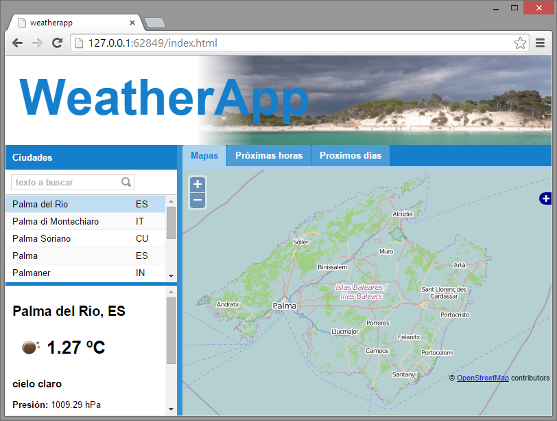
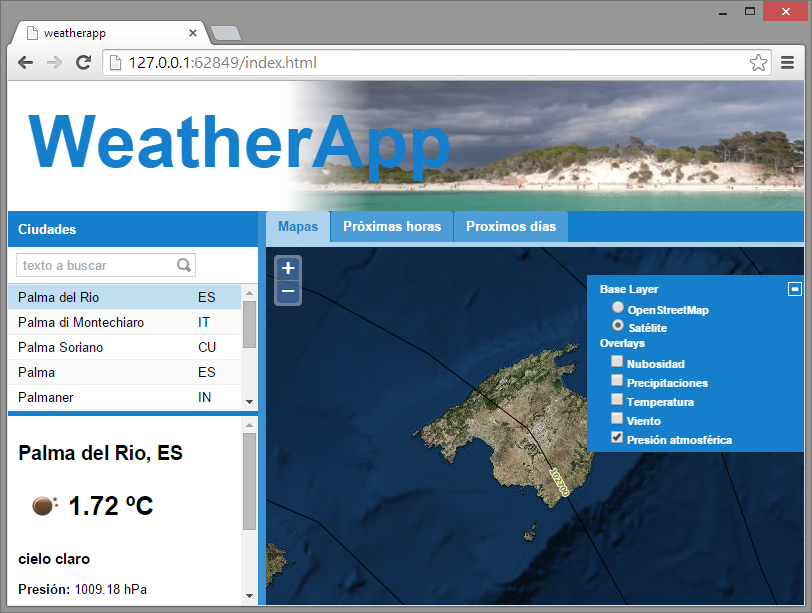
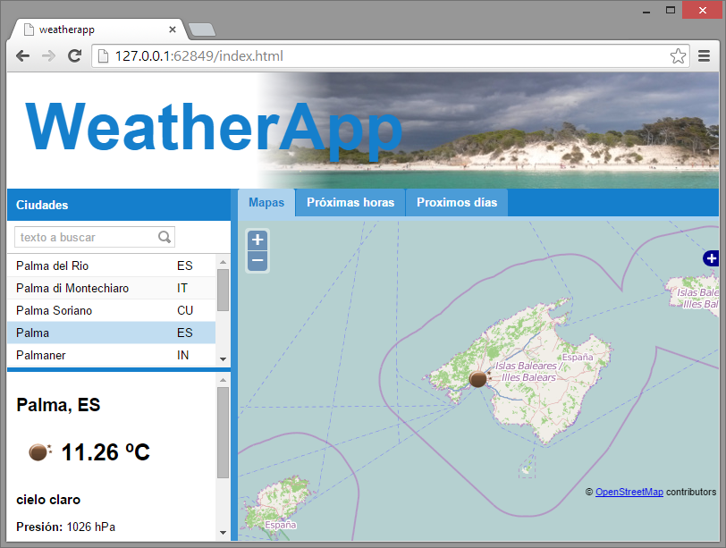

# GeoExt: ExtJS + OpenLayers

<a href="http://geoext.github.io/geoext2/" target="_blank">Geoext</a> es una librería de código abierto que, combinando las librerías ExtJS para la interfaz de usuario y OpenLayers para la funcionalidad SIG, facilita la construcción de aplicaciones web con funcionalidad similar a un SIG de escritorio. 

Geoext versión 2 está soportado para ExtJS v4.x y OpenLayers v2.x. 

Define nuevas <a href="http://geoext.github.io/geoext2/docs/" target="_blank">clases</a> ExtJS especializadas en gestión y visualización de datos geográficos: panel mapa, almacenes de datos para capas y elementos geográficos (_features_), acceso a servicios WMS y WFS, modelos de datos para los _capabilities_ de dichos servicios, árboles de gestión de capas base y de superposición, impresión de mapas...

Programar con Geoext implica **conocer**, ademas de la propia librería, ExtJS y OpenLayers.

<a href="http://openlayers.org/" target="_blank">OpenLayers</a> era, hasta hace poco más de 1 año, la librería de _web mapping_ de código abierto más completa y utilizada a la hora de desarrollar tanto pequeños mapas interactivos para mostar la localización de elementos, como aplicaciones GIS en entorno web.

Ahora se encuentra en la transición de la antigua <a href="http://openlayers.org/two/" target="_blank">versión 2</a> a la reciente versión 3, todavía poco documentada y utilizada.

El <a href="http://dev.openlayers.org/releases/OpenLayers-2.13.1/doc/apidocs/files/OpenLayers-js.html" target="_blank">manual de clases</a> de la versión 2 mantiene errores, inconsistencias y ausencias de propiedades y métodos.

## Proyecto

Continuamos con el proyecto WeatherApp, vamos a añadir una pestaña de mapas interactivos meteorológicos que nos proporcionará nuevamente el servicio <a href="http://openweathermap.org/hugemaps" target="_blank">OpenWeatherMap</a>.

Generamos una vista nueva para la pestaña de mapas, en la ventana de _Símbolo de Sistema_:

`sencha generate view --name TabMaps`

Modificamos la definición de la vista (app\view\TabMaps.js):

``` js
Ext.define("weatherapp.view.TabMaps", {
    extend: 'Ext.container.Container',
    alias : 'widget.weatherAppMapas',
    border: false,
    layout: 'fit'
});
```

Actualizar las referencias de la aplicación (app\Application.js):

``` js
Ext.define('weatherapp.Application', {
    name: 'weatherapp',

    extend: 'Ext.app.Application',

    requires:[
         'Ext.window.MessageBox'
    ],

    views: [
        'Ciudades',
		'TabHoras',
		'TabDias',
		'TabMaps'
    ],

    controllers: [
        'Main'
    ],

    stores: [
        'Ciudades',
		'Horas',
		'Dias'
   ]
});
```

Actualizamos el viewport (app\view\Main.js):

``` js
Ext.define('weatherapp.view.Main', {
    extend: 'Ext.container.Container',
    requires:[
        'Ext.tab.Panel',
        'Ext.layout.container.Border',
		'weatherapp.view.Ciudades',
		'weatherapp.view.TabHoras',
		'weatherapp.view.TabDias',
		'weatherapp.view.TabMaps'
    ],

    xtype: 'app-main',

    layout: {
        type: 'border'
    },

    items: [{
        region: 'north',
        cls: 'weatherapp-header-panel',
        xtype: 'container',
		layout: 'fit',
        height: 130,
		html: 'WeatherApp'
    },{
        region: 'west',
        xtype: 'weatherAppCiudades',
        title: 'Ciudades',
		collapsible: false,
		split: true,
        width: 250,
		maxWidth: 250,
		minWidth: 150
    },{
        region: 'center',
        xtype: 'tabpanel',
        deferredRender: false,
        items:[{
            title: 'Mapas',
			xtype: 'weatherAppMapas'
        }, {
            title: 'Próximas horas',
			xtype: 'weatherAppHoras'
        }, {
            title: 'Proximos días',
			xtype: 'weatherAppDias'
		}]
    }]
});
```

Commit "Vista TabMaps"

Integramos GeoExt en el proyecto:

Descargamos <a href="https://github.com/geoext/geoext2/archive/v2.0.2.zip" target="_blank">geoext2</a> y copiamos la carpeta _geoext2-2.0.2_ en la carpeta del proyecto (c:\weatherapp). 

Configuramos el no seguimiento de git, en Brackets botón  derecho sobre _geoext2-2.0.2_ y _Add to .gitignore_.

Creamos un fichero nuevo con nombre bootstrap_geoext.js en la carpeta del proyecto con el siguiente contenido:

``` js
Ext.Loader.addClassPathMappings({   
    "GeoExt": "geoext2-2.0.2/src/GeoExt"
});
```

Añadimos el mismo path de geoext al fichero de configuración del gestor de aplicaciones (.sencha\app\sencha.cfg), la línea 8 debe quedar:

`app.classpath=${app.dir}/app,${app.dir}/app.js,${app.dir}/geoext2-2.0.2/src/GeoExt/`

Cargamos las librerías de OpenLayers y añadimos la referencia a bootstrap_geoext.js a index.html:

``` html
<!DOCTYPE HTML>
<html>
<head>
    <meta charset="UTF-8">
    <title>weatherapp</title>
    <link rel="stylesheet" href="resources/weatherapp.css">
    <script src="http://openlayers.org/api/2.13.1/OpenLayers.js"></script>
    <!-- <x-compile> -->
        <!-- <x-bootstrap> -->
            <link rel="stylesheet" href="bootstrap.css">
            <script src="ext/ext-dev.js"></script>
            <script src="bootstrap.js"></script>
            <script src="bootstrap_geoext.js"></script>
        <!-- </x-bootstrap> -->
        <script src="app.js"></script>
    <!-- </x-compile> -->
</head>
<body></body>
</html>
```

Finalmente modificamos la vista app\view\TabMap.js para crear un mapa simple:

``` js
Ext.define("weatherapp.view.TabMaps", {
    extend: 'Ext.container.Container',
    requires: [
        'GeoExt.panel.Map',
        'GeoExt.slider.Zoom'
    ],
    alias : 'widget.weatherAppMapas',
    border: false,
    layout: 'fit',
    items: {
        xtype: 'gx_mappanel',
        itemId: 'mapPanel',
        center: '331600, 4809500',
        zoom: 9,
        map: {
            projection: "EPSG:3857",
            displayProjection: "EPSG:4326",
            allOverlays: false,
            controls: [
                new OpenLayers.Control.Navigation(),
                new OpenLayers.Control.Zoom(),
                new OpenLayers.Control.Attribution(),
                new OpenLayers.Control.LayerSwitcher()
            ]
        },
        layers: [
            new OpenLayers.Layer.OSM('OpenStreetMap')
        ]
    }
});
```

Commit "geoext"

En la ventana de _Símbolo de Sistema_, actualizamos cambios en la aplicación:

`sencha app build`

Refrescar el navegador y ver la nueva pestaña con mapa interactivo.



Añadimos al mapa una capa base satélite y los mapas meteorológicos (app\view\TabMaps.js):

``` js
Ext.define("weatherapp.view.TabMaps", {
    extend: 'Ext.container.Container',
    requires: [
        'GeoExt.panel.Map',
        'GeoExt.slider.Zoom'
    ],
    alias : 'widget.weatherAppMapas',
    border: false,
    layout: 'fit',
    items: {
        xtype: 'gx_mappanel',
        itemId: 'mapPanel',
        center: '331600, 4809500',
        zoom: 9,
        map: {
            projection: "EPSG:3857",
            displayProjection: "EPSG:4326",
            allOverlays: false,
            controls: [
                new OpenLayers.Control.Navigation(),
                new OpenLayers.Control.Zoom(),
                new OpenLayers.Control.Attribution(),
                new OpenLayers.Control.LayerSwitcher()
            ]
        },
        layers: [
            new OpenLayers.Layer.OSM('OpenStreetMap'),
            new OpenLayers.Layer.XYZ('Satélite',
               'http://server.arcgisonline.com/ArcGIS/rest/services/World_Imagery/MapServer/tile/${z}/${y}/${x}',
                {
                    sphericalMercator: true
                }
            ),
            new OpenLayers.Layer.XYZ("Nubosidad",
                "http://${s}.tile.openweathermap.org/map/clouds/${z}/${x}/${y}.png",
                {
                    isBaseLayer: false,
                    visibility: false,
                    opacity: 0.6,
                    sphericalMercator: true
                }
            ),
            new OpenLayers.Layer.XYZ("Precipitaciones",
                "http://${s}.tile.openweathermap.org/map/precipitation/${z}/${x}/${y}.png",
                {
                    isBaseLayer: false,
                    visibility: false,
                    opacity: 0.6,
                    sphericalMercator: true
                }
            ),
            new OpenLayers.Layer.XYZ("Temperatura",
                "http://${s}.tile.openweathermap.org/map/temp/${z}/${x}/${y}.png",
                {
                    isBaseLayer: false,
                    visibility: false,
                    opacity: 0.6,
                    sphericalMercator: true
                }
            ),
            new OpenLayers.Layer.XYZ("Viento",
                "http://${s}.tile.openweathermap.org/map/wind/${z}/${x}/${y}.png",
                {
                    isBaseLayer: false,
                    visibility: false,
                    opacity: 0.6,
                    sphericalMercator: true
                }
            ),
            new OpenLayers.Layer.XYZ("Presión atmosférica",
                "http://${s}.tile.openweathermap.org/map/pressure_cntr/${z}/${x}/${y}.png",
                {
                    isBaseLayer: false,
                    visibility: false,
                    sphericalMercator: true
                }
            )
        ]
    }
});
```

Commit "Capas adicionales"

Refrescar el navegador y ver las nuevas capas del mapa.



Sólo nos falta actualizar el mapa con la ciudad seleccionada y habremos terminado el proyecto.

Añadimos una capa vectorial al mapa para mostrar la ubicación de la ciudad (app\view\TabMaps.js):

``` js
Ext.define("weatherapp.view.TabMaps", {
    extend: 'Ext.container.Container',
    requires: [
        'GeoExt.panel.Map',
        'GeoExt.slider.Zoom'
    ],
    alias : 'widget.weatherAppMapas',
    border: false,
    layout: 'fit',
    items: {
        xtype: 'gx_mappanel',
        itemId: 'mapPanel',
        center: '331600, 4809500',
        zoom: 9,
        map: {
            projection: "EPSG:3857",
            displayProjection: "EPSG:4326",
            allOverlays: false,
            controls: [
                new OpenLayers.Control.Navigation(),
                new OpenLayers.Control.Zoom(),
                new OpenLayers.Control.Attribution(),
                new OpenLayers.Control.LayerSwitcher()
            ]
        },
        layers: [
            new OpenLayers.Layer.OSM('OpenStreetMap'),
            new OpenLayers.Layer.XYZ('Satélite',
               'http://server.arcgisonline.com/ArcGIS/rest/services/World_Imagery/MapServer/tile/${z}/${y}/${x}',
                {
                    sphericalMercator: true
                }
            ),
            new OpenLayers.Layer.XYZ("Nubosidad",
                "http://${s}.tile.openweathermap.org/map/clouds/${z}/${x}/${y}.png",
                {
                    isBaseLayer: false,
                    visibility: false,
                    opacity: 0.6,
                    sphericalMercator: true
                }
            ),
            new OpenLayers.Layer.XYZ("Precipitaciones",
                "http://${s}.tile.openweathermap.org/map/precipitation/${z}/${x}/${y}.png",
                {
                    isBaseLayer: false,
                    visibility: false,
                    opacity: 0.6,
                    sphericalMercator: true
                }
            ),
            new OpenLayers.Layer.XYZ("Temperatura",
                "http://${s}.tile.openweathermap.org/map/temp/${z}/${x}/${y}.png",
                {
                    isBaseLayer: false,
                    visibility: false,
                    opacity: 0.6,
                    sphericalMercator: true
                }
            ),
            new OpenLayers.Layer.XYZ("Viento",
                "http://${s}.tile.openweathermap.org/map/wind/${z}/${x}/${y}.png",
                {
                    isBaseLayer: false,
                    visibility: false,
                    opacity: 0.6,
                    sphericalMercator: true
                }
            ),
            new OpenLayers.Layer.XYZ("Presión atmosférica",
                "http://${s}.tile.openweathermap.org/map/pressure_cntr/${z}/${x}/${y}.png",
                {
                    isBaseLayer: false,
                    visibility: false,
                    sphericalMercator: true
                }
            ),
          new OpenLayers.Layer.Vector('Iconos', {displayInLayerSwitcher: false})
        ]
    }
});
```

Añadimos código en la función onCiudadSelect del controlador (app\controller\Main.js):

``` js
Ext.define('weatherapp.controller.Main', {
    extend: 'Ext.app.Controller',

	views: [
		'Ciudades'
	],

    refs: [{
        ref: 'InfoCiudad',
        selector: '#infoCiudad'
    }, {
        ref: 'LstCiudades',
        selector: '#lstCiudades'
    }, {
        ref: 'MapPanel',
        selector: '#mapPanel'
    }],

    stores: [
        'Ciudades',
        'Horas',
        'Dias'
    ],

    init: function() {
        this.control({
            '#lstCiudades': {
                select: this.onCiudadSelect
            },
            '#txtCiudad': {
                ontxtciudadclick: this.onCiudadSearch
            }
        });

        // Al cargar el store de ciudades, selecciona la primera de la lista
        this.getCiudadesStore().on('load', function(store, records, successful) {
            if (successful && records.length > 0) {
                this.getLstCiudades().getSelectionModel().select(0);
            }
        },
        this);
    },

    // Buscar ciudades
    onCiudadSearch: function(txt) {
        if (txt !== null) {
            this.getCiudadesStore().load({
                params: {
                    q: txt
                }
            });
        }
    },

	// Ciudad seleccionada
	onCiudadSelect: function(selModel, rec) {
		if (rec !== null) {
			this.getInfoCiudad().update(rec.data);
		}

        this.getHorasStore().load({
            params: {
                id: rec.data.id
            }
        });

        this.getDiasStore().load({
            params: {
                id: rec.data.id
            }
        });
      
        var map= this.getMapPanel().map,
            vl= map.layers[map.layers.length -1],
            ll= new OpenLayers.LonLat(rec.data.coord.lon, rec.data.coord.lat).transform(map.displayProjection, map.projection),
            p= new OpenLayers.Geometry.Point(ll.lon, ll.lat),
            v= new OpenLayers.Feature.Vector(p, {}, {
                externalGraphic: 'http://openweathermap.org/img/w/'+rec.data.weather[0].icon+'.png',
                graphicWidth: 50,
                graphicHeight:50
            });

        map.setCenter(ll, 8);
        vl.removeAllFeatures({silent:true});
        vl.addFeatures([v]);
	}

});
```

Commit "Ciudad en mapa"

Proyecto terminado, refrescamos navegador y vemos como al seleccionar ciudades cambia la vista del mapa y el icono del tiempo en la ciudad está sobre la misma:



En la ventana de _Símbolo de Sistema_, actualizamos cambios en la aplicación:

`sencha app build`

En el directorio _build_ del proyecto tenemos en _production\weatherapp_ la aplicación compilada y lista para desplegar en un servidor web.
